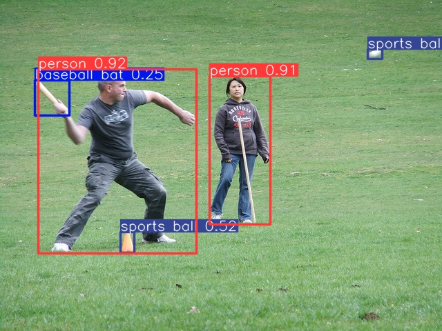
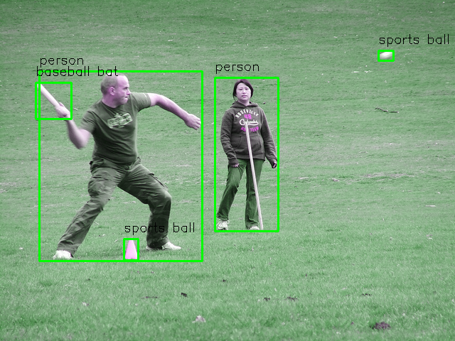

# Neural Network Accelerator
**Read this in other languages: [English](README.md), [中文](README_zh.md).**

This project aims to implement an acceleration circuit for convolutional neural networks. The project uses yolov8 as the implementation object, and the goal is to complete an acceleration circuit with operator operations such as convolution, residual sum, upsampling, pooling, and concat. Since the overall circuit design idea is efficient reusability and instructional calling, in addition to deploying the yolov8 network, other neural networks composed of the above operator operations can also be compiled onto the accelerator.

## Realizable operator operations
- **Convolution**
  
  3*3 convolution with stride (1 or 2) and padding (Whatever). You can choose whether to activate it (dynamically controlled by parameter instructions). 
  
  **// todo: add more details**
- **Residual sum**

  Residual sum of two feature maps. 
  
  **// todo: add more details**
- **Upsampling**

  upsampling of feature maps by a factor of 2. (I am sorry about that it is only support for factor of 2, and the mode is the simplest nearest) 
  
  **// todo: add more details**
- **Pooling**

  pooling of feature maps with max pooling. 
  
  **// todo: add more details**
- **Concat**
  
  The concat is not make in circuit. It is working in the memory allocate. 
  
  **// todo: add more details**

## Model compilation
  I wrote a lot of scripts to help debug this accelerator. Now I hope to integrate them into compilation related work. That is, I hope that anyone who can provide a network composed of supported operators and their corresponding quantized parameters can be compiled into instructions that can be run on my accelerator through these scripts. 
  
  (I have no idea whether it can be call "compilation" or just a fucking bullshit scripts.)

  **// todo: add more details**

## Status
- **2024-12-18**
  
  I have completed the hardware circuit design of the above operator. And the calculation of yolov8n was simulated on modelsim and the correct results were obtained. Driven by a 100M clock, it took 120ms to complete the calculation. The interface of the accelerator only has a set of AXI interfaces for memory reading and writing, and several parameter interfaces. In subsequent work, the parameter interfaces will be integrated into an AXI-lite interface for transmitting command parameters.

**Pytorch result** 

**My result(simulated on modelsim)** 

- **2024-12-24**

  The method of loading instructions is modified to read and write registers through the axi_lite interface, and the modelsim simulation is completed. During the simulation process, BFM is used to simulate the process of CPU scheduling axi_lite interface reading and writing registers.

- **2025-01-01**

  The deployment on xilinx 19EG has been completed, and the inference of static images in ddr has been completed. But the circuit design can only reach 200Mhz. Very sad, but, not bad.

- **2025-02-11**
  All dependent IP cores are written, so they can not depend on xilinx's IP core library. Set device=simulation in parameters.v file.
  Improve the compiler part, you can form an image processing network by yourself, and compile it into instructions to run it on the accelerator.

- **todo**

  1. Improve the logic on the ps side so that the accelerator supports single-step instruction operation and loop instruction operation.

## Reference
- [yolov8-prune-network](https://github.com/ybai789/yolov8-prune-network-slimming)
