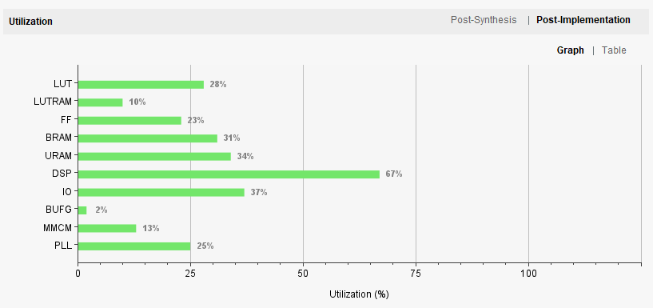
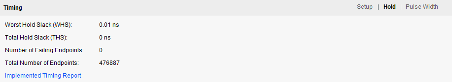

https://github.com/user-attachments/assets/8335d1ec-1887-406b-8871-6fd62e5cad1e


# Open Source Accelerator on FPGA
**Read this in other languages: [english](README.md), [chinese](readme_zh.md)**
**Development Log: [english](DevLog.md), [chinese](DevLog_zh.md)**

This project aims to implement an acceleration circuit for convolutional neural networks. The project uses yolov8 as the implementation object, and the goal is to complete an acceleration circuit with operator operations such as convolution, residual sum, upsampling, pooling, and concat. Since the overall circuit design idea is efficient reusability and instructional calling, in addition to deploying the yolov8 network, other neural networks composed of the above operator operations can also be compiled onto the accelerator.


# Implementable operators

| Operators      | Description |
| :-----------: | :-----------: |
| Convolution      | 3*3 convolution with stride (whatever you want, int or float) and padding (Whatever). You can choose whether to activate it (dynamically controlled by parameter instructions).       |
| Residual sum   | Residual sum of two feature maps.        |
| Upsampling | upsampling of feature maps by a factor of 2. Only support simplest nearest. |
| Pooling | pooling of feature maps with max pooling. |
| Concat | The concat is not make in circuit. It is working in the memory allocate. |

# Simulation Results

using 100Mhz clk to simulate the accelerator on yolov8n, total use 114ms.


# Working on xilinx (xczu7ev-ffvc1156-2-i)

The hardware deployment clock of the accelerator is 200Mhz, the single frame of yolov8n inference time is 60ms, and the post-processing time is 50ms. The inference and post-processing are carried out in parallel, so the total frame rate can reach 18-19FPS. 

<figure class="half">
    
    
</figure>


<figure>
    
    
    
</figure>


https://github.com/user-attachments/assets/aae8cbe7-0244-45a3-a5b3-8fbd66b3d928

# Quick Start

Now we have deployed two tasks on the accelerator, Yolov8 and filter.

## Environment
- modelsim
- python (include opencv, numpy)

use the following command to clone the respository:
```
git clone https://github.com/quanzaihh/Neural-Network-Accelerator
```

## Run the simulation
- Yolov8 simulation
download the yolov8n model from [yolov8n](https://pan.baidu.com/s/1zO5Mq82WNXEnz61mjo9NAw)(passcode:**d78m**) and put it in the  `Neural-Network-Accelerator\compile\yolov8` folder.

Run the following command to simulate the yolov8n model:
```
cd Neural-Network-Accelerator\compile\yolov8
python Yolov8.py --Operator 0
```

- Fliter simulation (Sobel filter)

Run the following command to simulate the Sobel filter:
```
cd Neural-Network-Accelerator\compile\imageprocess
python Filter.py --Operator 0
```

## Run the hardware implementation
- Yolov8 hardware implementation

First we need to compile the model into a hardware machine code.
```
cd Neural-Network-Accelerator\compile\yolov8
python Yolov8.py --Operator 1
```
Then we will get two files in the `Neural-Network-Accelerator\compile\compile_out` folder, which is `instruction.bin` and `WeightAndBias.bin`. The `instruction.bin` file is the hardware machine code, and the `WeightAndBias.bin` file is the weight and bias of the model. The yolov8n hardware machine code is show as below:

```
REFRESH_ORDER
SET       WLEN      0x011B0000
SET       ORDER     0x00000001
SET       FIBA      0x81000000
SET       FIPN      0x00000001
SET       FOPN      0x00000002
SET       FDP       0x00000000
SET       FPN       0x000004b0
SET       ROWS      0x000001e0
SET       COLS      0x00000280
SET       WQS       0x00000009
SET       FIQS      0x00000007
SET       FOQS      0x00000007
SET       MS        0x00000001
SET       RETAD     0x83800000
SET       RETPN     0x0000012c
SET       PADS      0x00000001
SET       ACT       0x00000001
SET       ID        0x00000000
SET       NEGTH     0x00000000
SET       OPTV      0x00000000
PUSH_ORDER
SET       ORDER     0x00000001
SET       FIBA      0x83800000
SET       FIPN      0x00000001
SET       FOPN      0x00000004
SET       FDP       0x00000001
SET       FPN       0x0000012c
SET       ROWS      0x000000f0
SET       COLS      0x00000140
SET       WQS       0x0000000c
SET       FIQS      0x00000007
SET       FOQS      0x00000007
SET       MS        0x00000001
SET       RETAD     0x83a58000
SET       RETPN     0x0000004b
SET       PADS      0x00000001
SET       ACT       0x00000001
SET       ID        0x00000001
SET       NEGTH     0x00000000
SET       OPTV      0x00000000
PUSH_ORDER
SET       ORDER     0x00000001
SET       FIBA      0x83a58000
SET       FIPN      0x00000002
SET       FOPN      0x00000004
SET       FDP       0x00000001
SET       FPN       0x0000004b
SET       ROWS      0x00000078
SET       COLS      0x000000a0
SET       WQS       0x0000000d
SET       FIQS      0x00000007
SET       FOQS      0x00000007
SET       MS        0x00000000
SET       RETAD     0x83b84000
SET       RETPN     0x0000004b
SET       PADS      0x00000001
SET       ACT       0x00000001
SET       ID        0x00000002
SET       NEGTH     0x00000000
SET       OPTV      0x00000000
PUSH_ORDER
SET       ORDER     0x00000001
SET       FIBA      0x83c1a000
SET       FIPN      0x00000001
SET       FOPN      0x00000002
SET       FDP       0x00000001
SET       FPN       0x0000004b
SET       ROWS      0x00000078
SET       COLS      0x000000a0
SET       WQS       0x0000000d
SET       FIQS      0x00000007
SET       FOQS      0x00000007
SET       MS        0x00000000
SET       RETAD     0x83d46000
SET       RETPN     0x0000004b
SET       PADS      0x00000001
SET       ACT       0x00000001
SET       ID        0x00000003
SET       NEGTH     0x00000000
SET       OPTV      0x00000000
PUSH_ORDER
SET       ORDER     0x00000001
SET       FIBA      0x83d46000
SET       FIPN      0x00000001
SET       FOPN      0x00000002
SET       FDP       0x00000001
SET       FPN       0x0000004b
SET       ROWS      0x00000078
SET       COLS      0x000000a0
SET       WQS       0x0000000e
SET       FIQS      0x00000007
SET       FOQS      0x00000007
SET       MS        0x00000000
SET       RETAD     0x83cb0000
SET       RETPN     0x0000004b
SET       PADS      0x00000001
SET       ACT       0x00000001
SET       ID        0x00000004
SET       NEGTH     0x00000000
SET       OPTV      0x00000000
PUSH_ORDER
SET       ORDER     0x00000002
SET       FIBA      0x83c1a000
SET       FIPN      0x00000001
SET       FOPN      0x00000001
SET       FDP       0x00000001
SET       FPN       0x00000096
SET       ROWS      0x000000c8
SET       COLS      0x000000c0
SET       WQS       0x00000000
SET       FIQS      0x00000000
SET       FOQS      0x00000000
SET       MS        0x00000000
SET       RETAD     0x83cb0000
SET       RETPN     0x00000096
SET       PADS      0x00000000
SET       ACT       0x00000000
SET       ID        0x00000005
SET       NEGTH     0x00000000
SET       OPTV      0x00000000
PUSH_ORDER
SET       ORDER     0x00000001
SET       FIBA      0x83b84000
SET       FIPN      0x00000003
SET       FOPN      0x00000004
SET       FDP       0x00000001
SET       FPN       0x0000004b
SET       ROWS      0x00000078
SET       COLS      0x000000a0
SET       WQS       0x0000000d
SET       FIQS      0x00000007
SET       FOQS      0x00000007
SET       MS        0x00000000
SET       RETAD     0x83ddc000
SET       RETPN     0x0000004b
SET       PADS      0x00000001
SET       ACT       0x00000001
SET       ID        0x00000006
SET       NEGTH     0x00000000
SET       OPTV      0x00000000
PUSH_ORDER
SET       ORDER     0x00000001
SET       FIBA      0x83ddc000
SET       FIPN      0x00000002
SET       FOPN      0x00000008
SET       FDP       0x00000001
SET       FPN       0x0000004b
SET       ROWS      0x00000078
SET       COLS      0x000000a0
SET       WQS       0x0000000f
SET       FIQS      0x00000007
SET       FOQS      0x00000007
SET       MS        0x00000001
SET       RETAD     0x83f08000
SET       RETPN     0x00000013
SET       PADS      0x00000001
SET       ACT       0x00000001
SET       ID        0x00000007
SET       NEGTH     0x00000000
SET       OPTV      0x00000000
PUSH_ORDER
SET       ORDER     0x00000001
SET       FIBA      0x83f08000
SET       FIPN      0x00000004
SET       FOPN      0x00000008
SET       FDP       0x00000001
SET       FPN       0x00000013
SET       ROWS      0x0000003c
SET       COLS      0x00000050
SET       WQS       0x0000000d
SET       FIQS      0x00000007
SET       FOQS      0x00000007
SET       MS        0x00000000
SET       RETAD     0x83fa0000
SET       RETPN     0x00000013
SET       PADS      0x00000001
SET       ACT       0x00000001
SET       ID        0x00000008
SET       NEGTH     0x00000000
SET       OPTV      0x00000000
PUSH_ORDER
SET       ORDER     0x00000001
SET       FIBA      0x83fec000
SET       FIPN      0x00000002
SET       FOPN      0x00000004
SET       FDP       0x00000001
SET       FPN       0x00000013
SET       ROWS      0x0000003c
SET       COLS      0x00000050
SET       WQS       0x0000000d
SET       FIQS      0x00000007
SET       FOQS      0x00000007
SET       MS        0x00000000
SET       RETAD     0x840d0000
SET       RETPN     0x00000013
SET       PADS      0x00000001
SET       ACT       0x00000001
SET       ID        0x00000009
SET       NEGTH     0x00000000
SET       OPTV      0x00000000
PUSH_ORDER
SET       ORDER     0x00000001
SET       FIBA      0x840d0000
SET       FIPN      0x00000002
SET       FOPN      0x00000004
SET       FDP       0x00000001
SET       FPN       0x00000013
SET       ROWS      0x0000003c
SET       COLS      0x00000050
SET       WQS       0x0000000e
SET       FIQS      0x00000007
SET       FOQS      0x00000007
SET       MS        0x00000000
SET       RETAD     0x84038000
SET       RETPN     0x00000013
SET       PADS      0x00000001
SET       ACT       0x00000001
SET       ID        0x0000000a
SET       NEGTH     0x00000000
SET       OPTV      0x00000000
PUSH_ORDER
SET       ORDER     0x00000002
SET       FIBA      0x83fec000
SET       FIPN      0x00000001
SET       FOPN      0x00000001
SET       FDP       0x00000001
SET       FPN       0x0000004c
SET       ROWS      0x00000098
SET       COLS      0x00000080
SET       WQS       0x00000000
SET       FIQS      0x00000000
SET       FOQS      0x00000000
SET       MS        0x00000000
SET       RETAD     0x84038000
SET       RETPN     0x0000004c
SET       PADS      0x00000000
SET       ACT       0x00000000
SET       ID        0x0000000b
SET       NEGTH     0x00000000
SET       OPTV      0x00000000
PUSH_ORDER
SET       ORDER     0x00000001
SET       FIBA      0x84038000
SET       FIPN      0x00000002
SET       FOPN      0x00000004
SET       FDP       0x00000001
SET       FPN       0x00000013
SET       ROWS      0x0000003c
SET       COLS      0x00000050
SET       WQS       0x0000000e
SET       FIQS      0x00000007
SET       FOQS      0x00000007
SET       MS        0x00000000
SET       RETAD     0x8411c000
SET       RETPN     0x00000013
SET       PADS      0x00000001
SET       ACT       0x00000001
SET       ID        0x0000000c
SET       NEGTH     0x00000000
SET       OPTV      0x00000000
PUSH_ORDER
SET       ORDER     0x00000001
SET       FIBA      0x8411c000
SET       FIPN      0x00000002
SET       FOPN      0x00000004
SET       FDP       0x00000001
SET       FPN       0x00000013
SET       ROWS      0x0000003c
SET       COLS      0x00000050
SET       WQS       0x0000000d
SET       FIQS      0x00000007
SET       FOQS      0x00000007
SET       MS        0x00000000
SET       RETAD     0x84084000
SET       RETPN     0x00000013
SET       PADS      0x00000001
SET       ACT       0x00000001
SET       ID        0x0000000d
SET       NEGTH     0x00000000
SET       OPTV      0x00000000
PUSH_ORDER
SET       ORDER     0x00000002
SET       FIBA      0x84038000
SET       FIPN      0x00000001
SET       FOPN      0x00000001
SET       FDP       0x00000001
SET       FPN       0x0000004c
SET       ROWS      0x00000098
SET       COLS      0x00000080
SET       WQS       0x00000000
SET       FIQS      0x00000000
SET       FOQS      0x00000000
SET       MS        0x00000000
SET       RETAD     0x84084000
SET       RETPN     0x0000004c
SET       PADS      0x00000000
SET       ACT       0x00000000
SET       ID        0x0000000e
SET       NEGTH     0x00000000
SET       OPTV      0x00000000
PUSH_ORDER
SET       ORDER     0x00000001
SET       FIBA      0x83fa0000
SET       FIPN      0x00000008
SET       FOPN      0x00000008
SET       FDP       0x00000001
SET       FPN       0x00000013
SET       ROWS      0x0000003c
SET       COLS      0x00000050
SET       WQS       0x0000000e
SET       FIQS      0x00000007
SET       FOQS      0x00000007
SET       MS        0x00000000
SET       RETAD     0x846e8000
SET       RETPN     0x00000013
SET       PADS      0x00000001
SET       ACT       0x00000001
SET       ID        0x0000000f
SET       NEGTH     0x00000000
SET       OPTV      0x00000000
PUSH_ORDER
SET       ORDER     0x00000001
SET       FIBA      0x846e8000
SET       FIPN      0x00000004
SET       FOPN      0x00000010
SET       FDP       0x00000001
SET       FPN       0x00000013
SET       ROWS      0x0000003c
SET       COLS      0x00000050
SET       WQS       0x0000000e
SET       FIQS      0x00000007
SET       FOQS      0x00000007
SET       MS        0x00000001
SET       RETAD     0x84168000
SET       RETPN     0x00000005
SET       PADS      0x00000001
SET       ACT       0x00000001
SET       ID        0x00000010
SET       NEGTH     0x00000000
SET       OPTV      0x00000000
PUSH_ORDER
SET       ORDER     0x00000001
SET       FIBA      0x84168000
SET       FIPN      0x00000008
SET       FOPN      0x00000010
SET       FDP       0x00000001
SET       FPN       0x00000005
SET       ROWS      0x0000001e
SET       COLS      0x00000028
SET       WQS       0x0000000d
SET       FIQS      0x00000007
SET       FOQS      0x00000007
SET       MS        0x00000000
SET       RETAD     0x841b8000
SET       RETPN     0x00000005
SET       PADS      0x00000001
SET       ACT       0x00000001
SET       ID        0x00000011
SET       NEGTH     0x00000000
SET       OPTV      0x00000000
PUSH_ORDER
SET       ORDER     0x00000001
SET       FIBA      0x841e0000
SET       FIPN      0x00000004
SET       FOPN      0x00000008
SET       FDP       0x00000001
SET       FPN       0x00000005
SET       ROWS      0x0000001e
SET       COLS      0x00000028
SET       WQS       0x0000000d
SET       FIQS      0x00000007
SET       FOQS      0x00000007
SET       MS        0x00000000
SET       RETAD     0x84258000
SET       RETPN     0x00000005
SET       PADS      0x00000001
SET       ACT       0x00000001
SET       ID        0x00000012
SET       NEGTH     0x00000000
SET       OPTV      0x00000000
PUSH_ORDER
SET       ORDER     0x00000001
SET       FIBA      0x84258000
SET       FIPN      0x00000004
SET       FOPN      0x00000008
SET       FDP       0x00000001
SET       FPN       0x00000005
SET       ROWS      0x0000001e
SET       COLS      0x00000028
SET       WQS       0x0000000e
SET       FIQS      0x00000007
SET       FOQS      0x00000007
SET       MS        0x00000000
SET       RETAD     0x84208000
SET       RETPN     0x00000005
SET       PADS      0x00000001
SET       ACT       0x00000001
SET       ID        0x00000013
SET       NEGTH     0x00000000
SET       OPTV      0x00000000
PUSH_ORDER
SET       ORDER     0x00000002
SET       FIBA      0x841e0000
SET       FIPN      0x00000001
SET       FOPN      0x00000001
SET       FDP       0x00000001
SET       FPN       0x00000028
SET       ROWS      0x00000080
SET       COLS      0x00000050
SET       WQS       0x00000000
SET       FIQS      0x00000000
SET       FOQS      0x00000000
SET       MS        0x00000000
SET       RETAD     0x84208000
SET       RETPN     0x00000028
SET       PADS      0x00000000
SET       ACT       0x00000000
SET       ID        0x00000014
SET       NEGTH     0x00000000
SET       OPTV      0x00000000
PUSH_ORDER
SET       ORDER     0x00000001
SET       FIBA      0x84208000
SET       FIPN      0x00000004
SET       FOPN      0x00000008
SET       FDP       0x00000001
SET       FPN       0x00000005
SET       ROWS      0x0000001e
SET       COLS      0x00000028
SET       WQS       0x0000000e
SET       FIQS      0x00000007
SET       FOQS      0x00000007
SET       MS        0x00000000
SET       RETAD     0x84280000
SET       RETPN     0x00000005
SET       PADS      0x00000001
SET       ACT       0x00000001
SET       ID        0x00000015
SET       NEGTH     0x00000000
SET       OPTV      0x00000000
PUSH_ORDER
SET       ORDER     0x00000001
SET       FIBA      0x84280000
SET       FIPN      0x00000004
SET       FOPN      0x00000008
SET       FDP       0x00000001
SET       FPN       0x00000005
SET       ROWS      0x0000001e
SET       COLS      0x00000028
SET       WQS       0x0000000c
SET       FIQS      0x00000007
SET       FOQS      0x00000007
SET       MS        0x00000000
SET       RETAD     0x84230000
SET       RETPN     0x00000005
SET       PADS      0x00000001
SET       ACT       0x00000001
SET       ID        0x00000016
SET       NEGTH     0x00000000
SET       OPTV      0x00000000
PUSH_ORDER
SET       ORDER     0x00000002
SET       FIBA      0x84208000
SET       FIPN      0x00000001
SET       FOPN      0x00000001
SET       FDP       0x00000001
SET       FPN       0x00000028
SET       ROWS      0x00000080
SET       COLS      0x00000050
SET       WQS       0x00000000
SET       FIQS      0x00000000
SET       FOQS      0x00000000
SET       MS        0x00000000
SET       RETAD     0x84230000
SET       RETPN     0x00000028
SET       PADS      0x00000000
SET       ACT       0x00000000
SET       ID        0x00000017
SET       NEGTH     0x00000000
SET       OPTV      0x00000000
PUSH_ORDER
SET       ORDER     0x00000001
SET       FIBA      0x841b8000
SET       FIPN      0x00000010
SET       FOPN      0x00000010
SET       FDP       0x00000001
SET       FPN       0x00000005
SET       ROWS      0x0000001e
SET       COLS      0x00000028
SET       WQS       0x0000000f
SET       FIQS      0x00000007
SET       FOQS      0x00000007
SET       MS        0x00000000
SET       RETAD     0x844c8000
SET       RETPN     0x00000005
SET       PADS      0x00000001
SET       ACT       0x00000001
SET       ID        0x00000018
SET       NEGTH     0x00000000
SET       OPTV      0x00000000
PUSH_ORDER
SET       ORDER     0x00000001
SET       FIBA      0x844c8000
SET       FIPN      0x00000008
SET       FOPN      0x00000020
SET       FDP       0x00000001
SET       FPN       0x00000005
SET       ROWS      0x0000001e
SET       COLS      0x00000028
SET       WQS       0x0000000f
SET       FIQS      0x00000007
SET       FOQS      0x00000007
SET       MS        0x00000001
SET       RETAD     0x842a8000
SET       RETPN     0x00000002
SET       PADS      0x00000001
SET       ACT       0x00000001
SET       ID        0x00000019
SET       NEGTH     0x00000000
SET       OPTV      0x00000000
PUSH_ORDER
SET       ORDER     0x00000001
SET       FIBA      0x842a8000
SET       FIPN      0x00000010
SET       FOPN      0x00000020
SET       FDP       0x00000001
SET       FPN       0x00000002
SET       ROWS      0x0000000f
SET       COLS      0x00000014
SET       WQS       0x0000000d
SET       FIQS      0x00000007
SET       FOQS      0x00000007
SET       MS        0x00000000
SET       RETAD     0x842e8000
SET       RETPN     0x00000002
SET       PADS      0x00000001
SET       ACT       0x00000001
SET       ID        0x0000001a
SET       NEGTH     0x00000000
SET       OPTV      0x00000000
PUSH_ORDER
SET       ORDER     0x00000001
SET       FIBA      0x84308000
SET       FIPN      0x00000008
SET       FOPN      0x00000010
SET       FDP       0x00000001
SET       FPN       0x00000002
SET       ROWS      0x0000000f
SET       COLS      0x00000014
SET       WQS       0x0000000e
SET       FIQS      0x00000007
SET       FOQS      0x00000007
SET       MS        0x00000000
SET       RETAD     0x84348000
SET       RETPN     0x00000002
SET       PADS      0x00000001
SET       ACT       0x00000001
SET       ID        0x0000001b
SET       NEGTH     0x00000000
SET       OPTV      0x00000000
PUSH_ORDER
SET       ORDER     0x00000001
SET       FIBA      0x84348000
SET       FIPN      0x00000008
SET       FOPN      0x00000010
SET       FDP       0x00000001
SET       FPN       0x00000002
SET       ROWS      0x0000000f
SET       COLS      0x00000014
SET       WQS       0x0000000d
SET       FIQS      0x00000007
SET       FOQS      0x00000007
SET       MS        0x00000000
SET       RETAD     0x84328000
SET       RETPN     0x00000002
SET       PADS      0x00000001
SET       ACT       0x00000001
SET       ID        0x0000001c
SET       NEGTH     0x00000000
SET       OPTV      0x00000000
PUSH_ORDER
SET       ORDER     0x00000002
SET       FIBA      0x84308000
SET       FIPN      0x00000001
SET       FOPN      0x00000001
SET       FDP       0x00000001
SET       FPN       0x00000020
SET       ROWS      0x00000080
SET       COLS      0x00000040
SET       WQS       0x00000000
SET       FIQS      0x00000000
SET       FOQS      0x00000000
SET       MS        0x00000000
SET       RETAD     0x84328000
SET       RETPN     0x00000020
SET       PADS      0x00000000
SET       ACT       0x00000000
SET       ID        0x0000001d
SET       NEGTH     0x00000000
SET       OPTV      0x00000000
PUSH_ORDER
SET       ORDER     0x00000001
SET       FIBA      0x842e8000
SET       FIPN      0x00000018
SET       FOPN      0x00000020
SET       FDP       0x00000001
SET       FPN       0x00000002
SET       ROWS      0x0000000f
SET       COLS      0x00000014
SET       WQS       0x0000000f
SET       FIQS      0x00000007
SET       FOQS      0x00000007
SET       MS        0x00000000
SET       RETAD     0x84368000
SET       RETPN     0x00000002
SET       PADS      0x00000001
SET       ACT       0x00000001
SET       ID        0x0000001e
SET       NEGTH     0x00000000
SET       OPTV      0x00000000
PUSH_ORDER
SET       ORDER     0x00000001
SET       FIBA      0x84368000
SET       FIPN      0x00000010
SET       FOPN      0x00000010
SET       FDP       0x00000001
SET       FPN       0x00000002
SET       ROWS      0x0000000f
SET       COLS      0x00000014
SET       WQS       0x0000000e
SET       FIQS      0x00000007
SET       FOQS      0x00000007
SET       MS        0x00000000
SET       RETAD     0x843a8000
SET       RETPN     0x00000002
SET       PADS      0x00000001
SET       ACT       0x00000001
SET       ID        0x0000001f
SET       NEGTH     0x00000000
SET       OPTV      0x00000000
PUSH_ORDER
SET       ORDER     0x00000003
SET       FIBA      0x843a8000
SET       FIPN      0x00000010
SET       FOPN      0x00000010
SET       FDP       0x00000000
SET       FPN       0x00000002
SET       ROWS      0x0000000f
SET       COLS      0x00000014
SET       WQS       0x00000000
SET       FIQS      0x00000007
SET       FOQS      0x00000000
SET       MS        0x00000000
SET       RETAD     0x843c8000
SET       RETPN     0x00000002
SET       PADS      0x00000002
SET       ACT       0x00000000
SET       ID        0x00000020
SET       NEGTH     0x00000000
SET       OPTV      0x00000000
PUSH_ORDER
SET       ORDER     0x00000003
SET       FIBA      0x843c8000
SET       FIPN      0x00000010
SET       FOPN      0x00000010
SET       FDP       0x00000000
SET       FPN       0x00000002
SET       ROWS      0x0000000f
SET       COLS      0x00000014
SET       WQS       0x00000000
SET       FIQS      0x00000007
SET       FOQS      0x00000000
SET       MS        0x00000000
SET       RETAD     0x843e8000
SET       RETPN     0x00000002
SET       PADS      0x00000002
SET       ACT       0x00000000
SET       ID        0x00000021
SET       NEGTH     0x00000000
SET       OPTV      0x00000000
PUSH_ORDER
SET       ORDER     0x00000003
SET       FIBA      0x843e8000
SET       FIPN      0x00000010
SET       FOPN      0x00000010
SET       FDP       0x00000000
SET       FPN       0x00000002
SET       ROWS      0x0000000f
SET       COLS      0x00000014
SET       WQS       0x00000000
SET       FIQS      0x00000007
SET       FOQS      0x00000000
SET       MS        0x00000000
SET       RETAD     0x84408000
SET       RETPN     0x00000002
SET       PADS      0x00000002
SET       ACT       0x00000000
SET       ID        0x00000022
SET       NEGTH     0x00000000
SET       OPTV      0x00000000
PUSH_ORDER
SET       ORDER     0x00000001
SET       FIBA      0x843a8000
SET       FIPN      0x00000020
SET       FOPN      0x00000020
SET       FDP       0x00000001
SET       FPN       0x00000002
SET       ROWS      0x0000000f
SET       COLS      0x00000014
SET       WQS       0x0000000d
SET       FIQS      0x00000007
SET       FOQS      0x00000007
SET       MS        0x00000000
SET       RETAD     0x84ad0000
SET       RETPN     0x00000002
SET       PADS      0x00000001
SET       ACT       0x00000001
SET       ID        0x00000023
SET       NEGTH     0x00000000
SET       OPTV      0x00000000
PUSH_ORDER
SET       ORDER     0x00000004
SET       FIBA      0x84ad0000
SET       FIPN      0x00000020
SET       FOPN      0x00000020
SET       FDP       0x00000000
SET       FPN       0x00000002
SET       ROWS      0x0000000f
SET       COLS      0x00000014
SET       WQS       0x00000000
SET       FIQS      0x00000007
SET       FOQS      0x00000000
SET       MS        0x00000000
SET       RETAD     0x84428000
SET       RETPN     0x00000005
SET       PADS      0x00000000
SET       ACT       0x00000000
SET       ID        0x00000024
SET       NEGTH     0x00000000
SET       OPTV      0x00000000
PUSH_ORDER
SET       ORDER     0x00000001
SET       FIBA      0x84428000
SET       FIPN      0x00000018
SET       FOPN      0x00000010
SET       FDP       0x00000001
SET       FPN       0x00000005
SET       ROWS      0x0000001e
SET       COLS      0x00000028
SET       WQS       0x0000000c
SET       FIQS      0x00000007
SET       FOQS      0x00000007
SET       MS        0x00000000
SET       RETAD     0x84518000
SET       RETPN     0x00000005
SET       PADS      0x00000001
SET       ACT       0x00000001
SET       ID        0x00000025
SET       NEGTH     0x00000000
SET       OPTV      0x00000000
PUSH_ORDER
SET       ORDER     0x00000001
SET       FIBA      0x84540000
SET       FIPN      0x00000004
SET       FOPN      0x00000008
SET       FDP       0x00000001
SET       FPN       0x00000005
SET       ROWS      0x0000001e
SET       COLS      0x00000028
SET       WQS       0x0000000e
SET       FIQS      0x00000007
SET       FOQS      0x00000007
SET       MS        0x00000000
SET       RETAD     0x84590000
SET       RETPN     0x00000005
SET       PADS      0x00000001
SET       ACT       0x00000001
SET       ID        0x00000026
SET       NEGTH     0x00000000
SET       OPTV      0x00000000
PUSH_ORDER
SET       ORDER     0x00000001
SET       FIBA      0x84590000
SET       FIPN      0x00000004
SET       FOPN      0x00000008
SET       FDP       0x00000001
SET       FPN       0x00000005
SET       ROWS      0x0000001e
SET       COLS      0x00000028
SET       WQS       0x0000000d
SET       FIQS      0x00000007
SET       FOQS      0x00000007
SET       MS        0x00000000
SET       RETAD     0x84568000
SET       RETPN     0x00000005
SET       PADS      0x00000001
SET       ACT       0x00000001
SET       ID        0x00000027
SET       NEGTH     0x00000000
SET       OPTV      0x00000000
PUSH_ORDER
SET       ORDER     0x00000001
SET       FIBA      0x84518000
SET       FIPN      0x0000000c
SET       FOPN      0x00000010
SET       FDP       0x00000001
SET       FPN       0x00000005
SET       ROWS      0x0000001e
SET       COLS      0x00000028
SET       WQS       0x0000000d
SET       FIQS      0x00000007
SET       FOQS      0x00000007
SET       MS        0x00000000
SET       RETAD     0x84970000
SET       RETPN     0x00000005
SET       PADS      0x00000001
SET       ACT       0x00000001
SET       ID        0x00000028
SET       NEGTH     0x00000000
SET       OPTV      0x00000000
PUSH_ORDER
SET       ORDER     0x00000004
SET       FIBA      0x84970000
SET       FIPN      0x00000010
SET       FOPN      0x00000010
SET       FDP       0x00000000
SET       FPN       0x00000005
SET       ROWS      0x0000001e
SET       COLS      0x00000028
SET       WQS       0x00000000
SET       FIQS      0x00000007
SET       FOQS      0x00000000
SET       MS        0x00000000
SET       RETAD     0x845b8000
SET       RETPN     0x00000013
SET       PADS      0x00000000
SET       ACT       0x00000000
SET       ID        0x00000029
SET       NEGTH     0x00000000
SET       OPTV      0x00000000
PUSH_ORDER
SET       ORDER     0x00000001
SET       FIBA      0x845b8000
SET       FIPN      0x0000000c
SET       FOPN      0x00000008
SET       FDP       0x00000001
SET       FPN       0x00000013
SET       ROWS      0x0000003c
SET       COLS      0x00000050
SET       WQS       0x0000000e
SET       FIQS      0x00000007
SET       FOQS      0x00000007
SET       MS        0x00000000
SET       RETAD     0x84780000
SET       RETPN     0x00000013
SET       PADS      0x00000001
SET       ACT       0x00000001
SET       ID        0x0000002a
SET       NEGTH     0x00000000
SET       OPTV      0x00000000
PUSH_ORDER
SET       ORDER     0x00000001
SET       FIBA      0x847cc000
SET       FIPN      0x00000002
SET       FOPN      0x00000004
SET       FDP       0x00000001
SET       FPN       0x00000013
SET       ROWS      0x0000003c
SET       COLS      0x00000050
SET       WQS       0x0000000e
SET       FIQS      0x00000007
SET       FOQS      0x00000007
SET       MS        0x00000000
SET       RETAD     0x84864000
SET       RETPN     0x00000013
SET       PADS      0x00000001
SET       ACT       0x00000001
SET       ID        0x0000002b
SET       NEGTH     0x00000000
SET       OPTV      0x00000000
PUSH_ORDER
SET       ORDER     0x00000001
SET       FIBA      0x84864000
SET       FIPN      0x00000002
SET       FOPN      0x00000004
SET       FDP       0x00000001
SET       FPN       0x00000013
SET       ROWS      0x0000003c
SET       COLS      0x00000050
SET       WQS       0x0000000e
SET       FIQS      0x00000007
SET       FOQS      0x00000007
SET       MS        0x00000000
SET       RETAD     0x84818000
SET       RETPN     0x00000013
SET       PADS      0x00000001
SET       ACT       0x00000001
SET       ID        0x0000002c
SET       NEGTH     0x00000000
SET       OPTV      0x00000000
PUSH_ORDER
SET       ORDER     0x00000001
SET       FIBA      0x84780000
SET       FIPN      0x00000006
SET       FOPN      0x00000008
SET       FDP       0x00000001
SET       FPN       0x00000013
SET       ROWS      0x0000003c
SET       COLS      0x00000050
SET       WQS       0x0000000d
SET       FIQS      0x00000007
SET       FOQS      0x00000007
SET       MS        0x00000000
SET       RETAD     0x848b0000
SET       RETPN     0x00000013
SET       PADS      0x00000001
SET       ACT       0x00000001
SET       ID        0x0000002d
SET       NEGTH     0x00000000
SET       OPTV      0x00000000
PUSH_ORDER
SET       ORDER     0x00000001
SET       FIBA      0x848b0000
SET       FIPN      0x00000004
SET       FOPN      0x00000008
SET       FDP       0x00000001
SET       FPN       0x00000013
SET       ROWS      0x0000003c
SET       COLS      0x00000050
SET       WQS       0x0000000e
SET       FIQS      0x00000007
SET       FOQS      0x00000007
SET       MS        0x00000001
SET       RETAD     0x84948000
SET       RETPN     0x00000005
SET       PADS      0x00000001
SET       ACT       0x00000001
SET       ID        0x0000002e
SET       NEGTH     0x00000000
SET       OPTV      0x00000000
PUSH_ORDER
SET       ORDER     0x00000001
SET       FIBA      0x84948000
SET       FIPN      0x0000000c
SET       FOPN      0x00000010
SET       FDP       0x00000001
SET       FPN       0x00000005
SET       ROWS      0x0000001e
SET       COLS      0x00000028
SET       WQS       0x0000000e
SET       FIQS      0x00000007
SET       FOQS      0x00000007
SET       MS        0x00000000
SET       RETAD     0x849c0000
SET       RETPN     0x00000005
SET       PADS      0x00000001
SET       ACT       0x00000001
SET       ID        0x0000002f
SET       NEGTH     0x00000000
SET       OPTV      0x00000000
PUSH_ORDER
SET       ORDER     0x00000001
SET       FIBA      0x849e8000
SET       FIPN      0x00000004
SET       FOPN      0x00000008
SET       FDP       0x00000001
SET       FPN       0x00000005
SET       ROWS      0x0000001e
SET       COLS      0x00000028
SET       WQS       0x0000000e
SET       FIQS      0x00000007
SET       FOQS      0x00000007
SET       MS        0x00000000
SET       RETAD     0x84a38000
SET       RETPN     0x00000005
SET       PADS      0x00000001
SET       ACT       0x00000001
SET       ID        0x00000030
SET       NEGTH     0x00000000
SET       OPTV      0x00000000
PUSH_ORDER
SET       ORDER     0x00000001
SET       FIBA      0x84a38000
SET       FIPN      0x00000004
SET       FOPN      0x00000008
SET       FDP       0x00000001
SET       FPN       0x00000005
SET       ROWS      0x0000001e
SET       COLS      0x00000028
SET       WQS       0x0000000d
SET       FIQS      0x00000007
SET       FOQS      0x00000007
SET       MS        0x00000000
SET       RETAD     0x84a10000
SET       RETPN     0x00000005
SET       PADS      0x00000001
SET       ACT       0x00000001
SET       ID        0x00000031
SET       NEGTH     0x00000000
SET       OPTV      0x00000000
PUSH_ORDER
SET       ORDER     0x00000001
SET       FIBA      0x849c0000
SET       FIPN      0x0000000c
SET       FOPN      0x00000010
SET       FDP       0x00000001
SET       FPN       0x00000005
SET       ROWS      0x0000001e
SET       COLS      0x00000028
SET       WQS       0x0000000d
SET       FIQS      0x00000007
SET       FOQS      0x00000007
SET       MS        0x00000000
SET       RETAD     0x84a60000
SET       RETPN     0x00000005
SET       PADS      0x00000001
SET       ACT       0x00000001
SET       ID        0x00000032
SET       NEGTH     0x00000000
SET       OPTV      0x00000000
PUSH_ORDER
SET       ORDER     0x00000001
SET       FIBA      0x84a60000
SET       FIPN      0x00000008
SET       FOPN      0x00000010
SET       FDP       0x00000001
SET       FPN       0x00000005
SET       ROWS      0x0000001e
SET       COLS      0x00000028
SET       WQS       0x0000000f
SET       FIQS      0x00000007
SET       FOQS      0x00000007
SET       MS        0x00000001
SET       RETAD     0x84ab0000
SET       RETPN     0x00000002
SET       PADS      0x00000001
SET       ACT       0x00000001
SET       ID        0x00000033
SET       NEGTH     0x00000000
SET       OPTV      0x00000000
PUSH_ORDER
SET       ORDER     0x00000001
SET       FIBA      0x84ab0000
SET       FIPN      0x00000018
SET       FOPN      0x00000020
SET       FDP       0x00000001
SET       FPN       0x00000002
SET       ROWS      0x0000000f
SET       COLS      0x00000014
SET       WQS       0x0000000e
SET       FIQS      0x00000007
SET       FOQS      0x00000007
SET       MS        0x00000000
SET       RETAD     0x84b10000
SET       RETPN     0x00000002
SET       PADS      0x00000001
SET       ACT       0x00000001
SET       ID        0x00000034
SET       NEGTH     0x00000000
SET       OPTV      0x00000000
PUSH_ORDER
SET       ORDER     0x00000001
SET       FIBA      0x84b30000
SET       FIPN      0x00000008
SET       FOPN      0x00000010
SET       FDP       0x00000001
SET       FPN       0x00000002
SET       ROWS      0x0000000f
SET       COLS      0x00000014
SET       WQS       0x0000000d
SET       FIQS      0x00000007
SET       FOQS      0x00000007
SET       MS        0x00000000
SET       RETAD     0x84b70000
SET       RETPN     0x00000002
SET       PADS      0x00000001
SET       ACT       0x00000001
SET       ID        0x00000035
SET       NEGTH     0x00000000
SET       OPTV      0x00000000
PUSH_ORDER
SET       ORDER     0x00000001
SET       FIBA      0x84b70000
SET       FIPN      0x00000008
SET       FOPN      0x00000010
SET       FDP       0x00000001
SET       FPN       0x00000002
SET       ROWS      0x0000000f
SET       COLS      0x00000014
SET       WQS       0x0000000d
SET       FIQS      0x00000007
SET       FOQS      0x00000007
SET       MS        0x00000000
SET       RETAD     0x84b50000
SET       RETPN     0x00000002
SET       PADS      0x00000001
SET       ACT       0x00000001
SET       ID        0x00000036
SET       NEGTH     0x00000000
SET       OPTV      0x00000000
PUSH_ORDER
SET       ORDER     0x00000001
SET       FIBA      0x84b10000
SET       FIPN      0x00000018
SET       FOPN      0x00000020
SET       FDP       0x00000001
SET       FPN       0x00000002
SET       ROWS      0x0000000f
SET       COLS      0x00000014
SET       WQS       0x0000000c
SET       FIQS      0x00000007
SET       FOQS      0x00000007
SET       MS        0x00000000
SET       RETAD     0x84b90000
SET       RETPN     0x00000002
SET       PADS      0x00000001
SET       ACT       0x00000001
SET       ID        0x00000037
SET       NEGTH     0x00000000
SET       OPTV      0x00000000
PUSH_ORDER
SET       ORDER     0x00000001
SET       FIBA      0x848b0000
SET       FIPN      0x00000004
SET       FOPN      0x00000008
SET       FDP       0x00000001
SET       FPN       0x00000013
SET       ROWS      0x0000003c
SET       COLS      0x00000050
SET       WQS       0x0000000e
SET       FIQS      0x00000007
SET       FOQS      0x00000007
SET       MS        0x00000000
SET       RETAD     0x84bd0000
SET       RETPN     0x00000013
SET       PADS      0x00000001
SET       ACT       0x00000001
SET       ID        0x00000038
SET       NEGTH     0x00000000
SET       OPTV      0x00000000
PUSH_ORDER
SET       ORDER     0x00000001
SET       FIBA      0x84bd0000
SET       FIPN      0x00000004
SET       FOPN      0x00000008
SET       FDP       0x00000001
SET       FPN       0x00000013
SET       ROWS      0x0000003c
SET       COLS      0x00000050
SET       WQS       0x0000000c
SET       FIQS      0x00000007
SET       FOQS      0x00000007
SET       MS        0x00000000
SET       RETAD     0x84c68000
SET       RETPN     0x00000013
SET       PADS      0x00000001
SET       ACT       0x00000001
SET       ID        0x00000039
SET       NEGTH     0x00000000
SET       OPTV      0x00000000
PUSH_ORDER
SET       ORDER     0x00000001
SET       FIBA      0x84c68000
SET       FIPN      0x00000004
SET       FOPN      0x00000008
SET       FDP       0x00000001
SET       FPN       0x00000013
SET       ROWS      0x0000003c
SET       COLS      0x00000050
SET       WQS       0x0000000e
SET       FIQS      0x00000007
SET       FOQS      0x00000007
SET       MS        0x00000000
SET       RETAD     0x84d00000
SET       RETPN     0x00000013
SET       PADS      0x00000001
SET       ACT       0x00000000
SET       ID        0x0000003a
SET       NEGTH     0x00000000
SET       OPTV      0x00000000
PUSH_ORDER
SET       ORDER     0x00000001
SET       FIBA      0x84a60000
SET       FIPN      0x00000008
SET       FOPN      0x00000008
SET       FDP       0x00000001
SET       FPN       0x00000005
SET       ROWS      0x0000001e
SET       COLS      0x00000028
SET       WQS       0x0000000e
SET       FIQS      0x00000007
SET       FOQS      0x00000007
SET       MS        0x00000000
SET       RETAD     0x84d98000
SET       RETPN     0x00000005
SET       PADS      0x00000001
SET       ACT       0x00000001
SET       ID        0x0000003b
SET       NEGTH     0x00000000
SET       OPTV      0x00000000
PUSH_ORDER
SET       ORDER     0x00000001
SET       FIBA      0x84d98000
SET       FIPN      0x00000004
SET       FOPN      0x00000008
SET       FDP       0x00000001
SET       FPN       0x00000005
SET       ROWS      0x0000001e
SET       COLS      0x00000028
SET       WQS       0x0000000c
SET       FIQS      0x00000007
SET       FOQS      0x00000007
SET       MS        0x00000000
SET       RETAD     0x84dc0000
SET       RETPN     0x00000005
SET       PADS      0x00000001
SET       ACT       0x00000001
SET       ID        0x0000003c
SET       NEGTH     0x00000000
SET       OPTV      0x00000000
PUSH_ORDER
SET       ORDER     0x00000001
SET       FIBA      0x84dc0000
SET       FIPN      0x00000004
SET       FOPN      0x00000008
SET       FDP       0x00000001
SET       FPN       0x00000005
SET       ROWS      0x0000001e
SET       COLS      0x00000028
SET       WQS       0x0000000e
SET       FIQS      0x00000007
SET       FOQS      0x00000007
SET       MS        0x00000000
SET       RETAD     0x84de8000
SET       RETPN     0x00000005
SET       PADS      0x00000001
SET       ACT       0x00000000
SET       ID        0x0000003d
SET       NEGTH     0x00000000
SET       OPTV      0x00000000
PUSH_ORDER
SET       ORDER     0x00000001
SET       FIBA      0x84b90000
SET       FIPN      0x00000010
SET       FOPN      0x00000008
SET       FDP       0x00000001
SET       FPN       0x00000002
SET       ROWS      0x0000000f
SET       COLS      0x00000014
SET       WQS       0x0000000d
SET       FIQS      0x00000007
SET       FOQS      0x00000007
SET       MS        0x00000000
SET       RETAD     0x84e10000
SET       RETPN     0x00000002
SET       PADS      0x00000001
SET       ACT       0x00000001
SET       ID        0x0000003e
SET       NEGTH     0x00000000
SET       OPTV      0x00000000
PUSH_ORDER
SET       ORDER     0x00000001
SET       FIBA      0x84e10000
SET       FIPN      0x00000004
SET       FOPN      0x00000008
SET       FDP       0x00000001
SET       FPN       0x00000002
SET       ROWS      0x0000000f
SET       COLS      0x00000014
SET       WQS       0x0000000d
SET       FIQS      0x00000007
SET       FOQS      0x00000007
SET       MS        0x00000000
SET       RETAD     0x84e20000
SET       RETPN     0x00000002
SET       PADS      0x00000001
SET       ACT       0x00000001
SET       ID        0x0000003f
SET       NEGTH     0x00000000
SET       OPTV      0x00000000
PUSH_ORDER
SET       ORDER     0x00000001
SET       FIBA      0x84e20000
SET       FIPN      0x00000004
SET       FOPN      0x00000008
SET       FDP       0x00000001
SET       FPN       0x00000002
SET       ROWS      0x0000000f
SET       COLS      0x00000014
SET       WQS       0x0000000e
SET       FIQS      0x00000007
SET       FOQS      0x00000007
SET       MS        0x00000000
SET       RETAD     0x84e30000
SET       RETPN     0x00000002
SET       PADS      0x00000001
SET       ACT       0x00000000
SET       ID        0x00000040
SET       NEGTH     0x00000000
SET       OPTV      0x00000000
PUSH_ORDER
SET       ORDER     0x00000001
SET       FIBA      0x848b0000
SET       FIPN      0x00000004
SET       FOPN      0x0000000a
SET       FDP       0x00000001
SET       FPN       0x00000013
SET       ROWS      0x0000003c
SET       COLS      0x00000050
SET       WQS       0x0000000e
SET       FIQS      0x00000007
SET       FOQS      0x00000007
SET       MS        0x00000000
SET       RETAD     0x84e40000
SET       RETPN     0x00000013
SET       PADS      0x00000001
SET       ACT       0x00000001
SET       ID        0x00000041
SET       NEGTH     0x00000000
SET       OPTV      0x00000000
PUSH_ORDER
SET       ORDER     0x00000001
SET       FIBA      0x84e40000
SET       FIPN      0x00000005
SET       FOPN      0x0000000a
SET       FDP       0x00000001
SET       FPN       0x00000013
SET       ROWS      0x0000003c
SET       COLS      0x00000050
SET       WQS       0x0000000b
SET       FIQS      0x00000007
SET       FOQS      0x00000007
SET       MS        0x00000000
SET       RETAD     0x84efe000
SET       RETPN     0x00000013
SET       PADS      0x00000001
SET       ACT       0x00000001
SET       ID        0x00000042
SET       NEGTH     0x00000000
SET       OPTV      0x00000000
PUSH_ORDER
SET       ORDER     0x00000001
SET       FIBA      0x84efe000
SET       FIPN      0x00000005
SET       FOPN      0x0000000a
SET       FDP       0x00000001
SET       FPN       0x00000013
SET       ROWS      0x0000003c
SET       COLS      0x00000050
SET       WQS       0x0000000f
SET       FIQS      0x00000007
SET       FOQS      0x00000007
SET       MS        0x00000000
SET       RETAD     0x84fbc000
SET       RETPN     0x00000013
SET       PADS      0x00000001
SET       ACT       0x00000001
SET       ID        0x00000043
SET       NEGTH     0xff4f0000
SET       OPTV      0x00000000
PUSH_ORDER
SET       ORDER     0x00000001
SET       FIBA      0x84a60000
SET       FIPN      0x00000008
SET       FOPN      0x0000000a
SET       FDP       0x00000001
SET       FPN       0x00000005
SET       ROWS      0x0000001e
SET       COLS      0x00000028
SET       WQS       0x0000000e
SET       FIQS      0x00000007
SET       FOQS      0x00000007
SET       MS        0x00000000
SET       RETAD     0x8507a000
SET       RETPN     0x00000005
SET       PADS      0x00000001
SET       ACT       0x00000001
SET       ID        0x00000044
SET       NEGTH     0x00000000
SET       OPTV      0x00000000
PUSH_ORDER
SET       ORDER     0x00000001
SET       FIBA      0x8507a000
SET       FIPN      0x00000005
SET       FOPN      0x0000000a
SET       FDP       0x00000001
SET       FPN       0x00000005
SET       ROWS      0x0000001e
SET       COLS      0x00000028
SET       WQS       0x0000000a
SET       FIQS      0x00000007
SET       FOQS      0x00000007
SET       MS        0x00000000
SET       RETAD     0x850ac000
SET       RETPN     0x00000005
SET       PADS      0x00000001
SET       ACT       0x00000001
SET       ID        0x00000045
SET       NEGTH     0x00000000
SET       OPTV      0x00000000
PUSH_ORDER
SET       ORDER     0x00000001
SET       FIBA      0x850ac000
SET       FIPN      0x00000005
SET       FOPN      0x0000000a
SET       FDP       0x00000001
SET       FPN       0x00000005
SET       ROWS      0x0000001e
SET       COLS      0x00000028
SET       WQS       0x0000000f
SET       FIQS      0x00000007
SET       FOQS      0x00000007
SET       MS        0x00000000
SET       RETAD     0x850de000
SET       RETPN     0x00000005
SET       PADS      0x00000001
SET       ACT       0x00000001
SET       ID        0x00000046
SET       NEGTH     0xff4f0000
SET       OPTV      0x00000000
PUSH_ORDER
SET       ORDER     0x00000001
SET       FIBA      0x84b90000
SET       FIPN      0x00000010
SET       FOPN      0x0000000a
SET       FDP       0x00000001
SET       FPN       0x00000002
SET       ROWS      0x0000000f
SET       COLS      0x00000014
SET       WQS       0x0000000d
SET       FIQS      0x00000007
SET       FOQS      0x00000007
SET       MS        0x00000000
SET       RETAD     0x85110000
SET       RETPN     0x00000002
SET       PADS      0x00000001
SET       ACT       0x00000001
SET       ID        0x00000047
SET       NEGTH     0x00000000
SET       OPTV      0x00000000
PUSH_ORDER
SET       ORDER     0x00000001
SET       FIBA      0x85110000
SET       FIPN      0x00000005
SET       FOPN      0x0000000a
SET       FDP       0x00000001
SET       FPN       0x00000002
SET       ROWS      0x0000000f
SET       COLS      0x00000014
SET       WQS       0x0000000a
SET       FIQS      0x00000007
SET       FOQS      0x00000007
SET       MS        0x00000000
SET       RETAD     0x85124000
SET       RETPN     0x00000002
SET       PADS      0x00000001
SET       ACT       0x00000001
SET       ID        0x00000048
SET       NEGTH     0x00000000
SET       OPTV      0x00000000
PUSH_ORDER
SET       ORDER     0x00000001
SET       FIBA      0x85124000
SET       FIPN      0x00000005
SET       FOPN      0x0000000a
SET       FDP       0x00000001
SET       FPN       0x00000002
SET       ROWS      0x0000000f
SET       COLS      0x00000014
SET       WQS       0x0000000f
SET       FIQS      0x00000007
SET       FOQS      0x00000007
SET       MS        0x00000000
SET       RETAD     0x85138000
SET       RETPN     0x00000002
SET       PADS      0x00000001
SET       ACT       0x00000001
SET       ID        0x00000049
SET       NEGTH     0xff4f0000
SET       OPTV      0x00000000
PUSH_ORDER
SET       ORDER     0x00000001
SET       FIBA      0x84fbc000
SET       FIPN      0x00000005
SET       FOPN      0x00000001
SET       FDP       0x00000001
SET       FPN       0x00000013
SET       ROWS      0x0000003c
SET       COLS      0x00000050
SET       WQS       0x00000000
SET       FIQS      0x00000007
SET       FOQS      0x00000007
SET       MS        0x00000000
SET       RETAD     0x8514c000
SET       RETPN     0x00000013
SET       PADS      0x00000001
SET       ACT       0x00000000
SET       ID        0x0000004a
SET       NEGTH     0x00000000
SET       OPTV      0x00000000
PUSH_ORDER
SET       ORDER     0x00000001
SET       FIBA      0x850de000
SET       FIPN      0x00000005
SET       FOPN      0x00000001
SET       FDP       0x00000001
SET       FPN       0x00000005
SET       ROWS      0x0000001e
SET       COLS      0x00000028
SET       WQS       0x00000000
SET       FIQS      0x00000007
SET       FOQS      0x00000007
SET       MS        0x00000000
SET       RETAD     0x8515f000
SET       RETPN     0x00000005
SET       PADS      0x00000001
SET       ACT       0x00000000
SET       ID        0x0000004b
SET       NEGTH     0x00000000
SET       OPTV      0x00000000
PUSH_ORDER
SET       ORDER     0x00000001
SET       FIBA      0x85138000
SET       FIPN      0x00000005
SET       FOPN      0x00000001
SET       FDP       0x00000001
SET       FPN       0x00000002
SET       ROWS      0x0000000f
SET       COLS      0x00000014
SET       WQS       0x00000000
SET       FIQS      0x00000007
SET       FOQS      0x00000007
SET       MS        0x00000000
SET       RETAD     0x85164000
SET       RETPN     0x00000002
SET       PADS      0x00000001
SET       ACT       0x00000000
SET       ID        0x0000004c
SET       NEGTH     0x00000000
SET       OPTV      0x00000000
PUSH_ORDER
SET       ORDER     0x00000005
PUSH_ORDER
```

Use the Axi-lite to write the above code to the Accelerator. You can use xilinx's process system to operate. The hardware project will be provided in the future.

- Filter hardware implementation

```
cd Neural-Network-Accelerator\compile\imageprocess
python Filter.py --Operator 1
```
Then we will get two files in the `Neural-Network-Accelerator\compile\compile_out` folder, which is `instruction.bin` and `WeightAndBias.bin`. The instruction.bin file is the hardware machine code, and the WeightAndBias.bin file is the weight and bias of the model. The Filter hardware machine code is show as below:

```
REFRESH_ORDER
SET       WLEN      0x011B0000
SET       ORDER     0x00000001
SET       FIBA      0x81000000
SET       FIPN      0x00000001
SET       FOPN      0x00000001
SET       FDP       0x00000000
SET       FPN       0x000004b0
SET       ROWS      0x000001e0
SET       COLS      0x00000280
SET       WQS       0x00000007
SET       FIQS      0x00000007
SET       FOQS      0x00000007
SET       MS        0x00000000
SET       RETAD     0x00000280
SET       RETPN     0x000004b0
SET       PADS      0x00000001
SET       ACT       0x00000000
SET       ID        0x00000000
SET       NEGTH     0x00000000
SET       OPTV      0x00000001
PUSH_ORDER
SET       ORDER     0x00000005
PUSH_ORDER
```

# TODO
- Expand the versatility and attempt to achieve convolution with convolutional kernels of different sizes through scheduling while keeping the array topology unchanged.
- Deploy other Convolutional Neural Network tasks on the accelerator, such as image compression, image denoising, etc.

# My channel

Bilibili: https://space.bilibili.com/288251497?spm_id_from=333.788.0.0

## Reference
- [yolov8-prune-network](https://github.com/ybai789/yolov8-prune-network-slimming)
- [Eyeriss: An Energy-Efficient Reconfigurable Accelerator for Deep Convolutional Neural Networks](https://ieeexplore.ieee.org/abstract/document/7738524)
