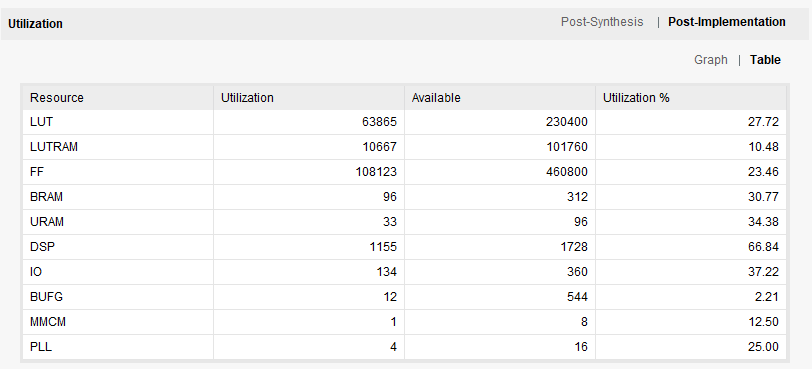
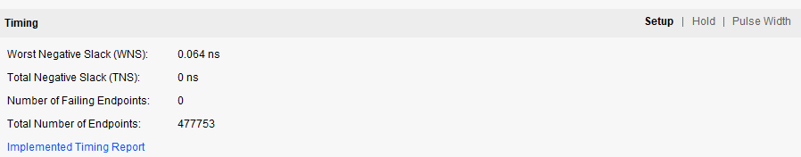

# Open Source Accelerator on FPGA
**Read this in other languages: [english](README.md), [chinese](readme_zh.md)**
**Development Log: [english](DevLog.md), [chinese](DevLog_zh.md)**

This project aims to implement an acceleration circuit for convolutional neural networks. The project uses yolov8 as the implementation object, and the goal is to complete an acceleration circuit with operator operations such as convolution, residual sum, upsampling, pooling, and concat. Since the overall circuit design idea is efficient reusability and instructional calling, in addition to deploying the yolov8 network, other neural networks composed of the above operator operations can also be compiled onto the accelerator.

# Implementable operators

| Operators      | Description |
| :-----------: | :-----------: |
| Convolution      | 3*3 convolution with stride (1 or 2) and padding (Whatever). You can choose whether to activate it (dynamically controlled by parameter instructions).       |
| Residual sum   | Residual sum of two feature maps.        |
| Upsampling | upsampling of feature maps by a factor of 2. Only support simplest nearest. |
| Pooling | pooling of feature maps with max pooling. |
| Concat | The concat is not make in circuit. It is working in the memory allocate. |

# Simulation Results

using 100Mhz clk to simulate the accelerator on yolov8n, total use 114ms.

# Working on xilinx 19EG

The hardware deployment clock of the accelerator is 200Mhz, the single frame of yolov8n inference time is 60ms, and the post-processing time is 50ms. The inference and post-processing are carried out in parallel, so the total frame rate can reach 18-19FPS. 

<figure class="half">
    
    
</figure>

<figure>
    
    
    
</figure>

https://github.com/user-attachments/assets/aae8cbe7-0244-45a3-a5b3-8fbd66b3d928

# My channel

Bilibili: https://www.bilibili.com/video/BV1YBwdeGEQL/?spm_id_from=333.1387.homepage.video_card.click&vd_source=adcb6ca5248fa9aa53c8041deee6707b

## Reference
- [yolov8-prune-network](https://github.com/ybai789/yolov8-prune-network-slimming)
- [Eyeriss: An Energy-Efficient Reconfigurable Accelerator for Deep Convolutional Neural Networks](https://ieeexplore.ieee.org/abstract/document/7738524)
