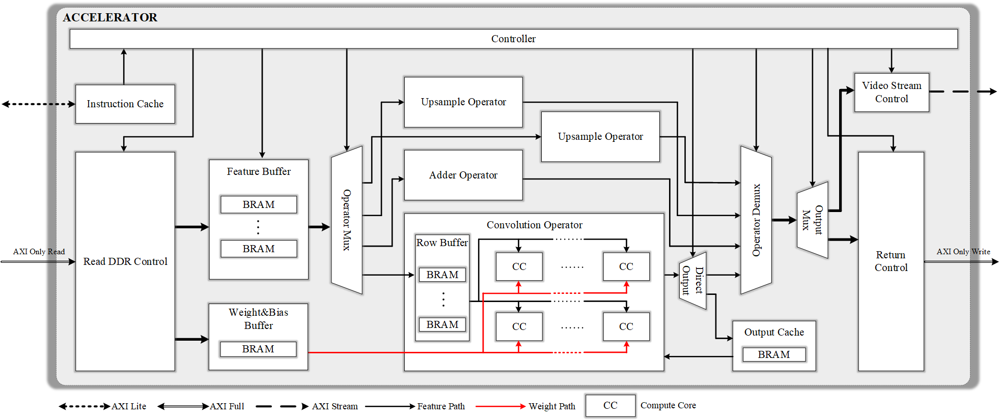
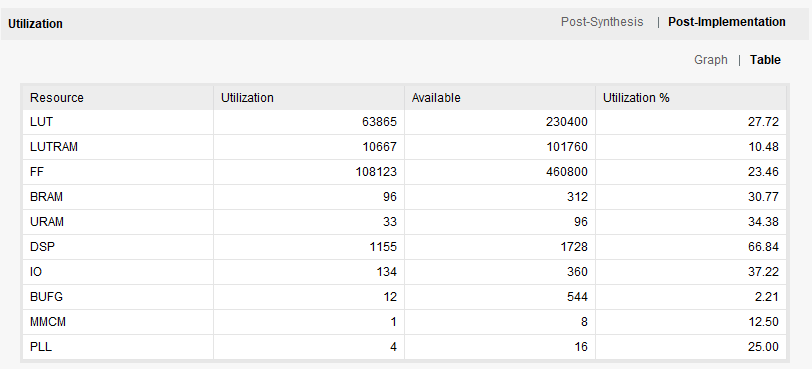
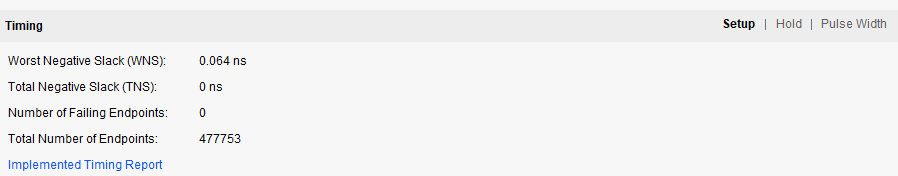
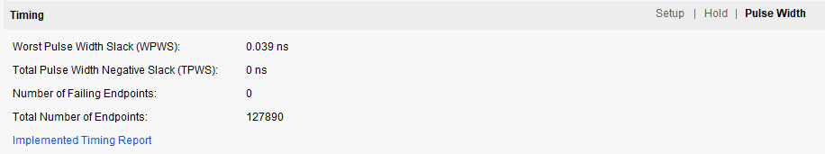

# Open Source Accelerator on FPGA
**切换语言: [英语](README.md), [中文](readme_zh.md)**
**开发日志: [英语](DevLog.md), [中文](DevLog_zh.md)**

该项目旨在实现卷积神经网络的加速电路。项目以yolov8为实现对象，目标是完成一个包含卷积、残差和、上采样、池化、concat等算子操作的加速电路。由于整体电路设计思想是高效复用和指令化调用，因此除了部署yolov8网络外，由上述算子操作组成的其他神经网络也可以编译到加速器上。



# 可实现算子

| 算子名称       | 描述 |
| :-----------: | :-----------: |
| 卷积      | 3*3的卷积操作，步幅为任意你想要的值（整数或者浮点数都可以）， 和padding为任意。可以选择是否激活（由参数指令动态控制）。       |
| 残差和   | 两个特征块的残差和。        |
| 上采样 | 对特征图进行2倍上采样。仅支持nearest模式 |
| 池化 | 对特征图做最大值池化，支持步幅为1或者2。 |
| 拼接 | 拼接操作（concat）不通过硬件电路实现，而是在内存分配的过程中实现。 |

# 仿真结果

加速器的仿真时钟是100Mhz，yolov8n的单帧推理时间是113ms。
                                                                                                                                                                                                                                                                                                                        

# 部署到xilinx (xczu7ev-ffvc1156-2-i)上

<figure class="half">
    
    
</figure>


<figure>
    
    
    
</figure>


加速器的硬件部署时钟为200MHz，Yolov8n单帧推理时间为60ms，后处理时间为50ms。推理和后处理是并行进行的，因此总帧速率可以达到18-19fps。 

https://github.com/user-attachments/assets/aae8cbe7-0244-45a3-a5b3-8fbd66b3d928

# Quick Start

现在，我们已经在加速器部署了两个任务，yolov8和滤波器。

## 环境准备

- modelsim
- python (包含 opencv, numpy)

使用以下命令复制仓库

```
git clone https://github.com/quanzaihh/Neural-Network-Accelerator
```

## 仿真
- Yolov8 仿真

下载yolov8的模型文件[yolov8n](https://pan.baidu.com/s/1zO5Mq82WNXEnz61mjo9NAw)(passcode:**d78m**) 将其放到`Neural-Network-Accelerator\compile\yolov8` 文件夹.

运行以下代码以仿真yolov8

```
cd Neural-Network-Accelerator\compile\yolov8
python Yolov8.py --Operator 0
```

- 滤波器仿真 (边缘滤波)

运行以下代码以仿真边缘滤波器
```
cd Neural-Network-Accelerator\compile\imageprocess
python Filter.py --Operator 0
```

## 在硬件上部署

- Yolov8 硬件部署

首先我们需要编译模型为硬件机器码

```
cd Neural-Network-Accelerator\compile\yolov8
python Yolov8.py --Operator 1
```

然后我们会得到两个文件在`Neural-Network-Accelerator\compile\compile_out`文件夹下，分别是`instruction.bin` and `WeightAndBias.bin`。`instruction.bin`文件是硬件机器码，`WeightAndBias.bin`文件是模型参数。Yolov8n的硬件机器码如下所示：

```
REFRESH_ORDER
SET       WLEN      0x011B0000
SET       ORDER     0x00000001
SET       FIBA      0x81000000
SET       FIPN      0x00000001
SET       FOPN      0x00000002
SET       FDP       0x00000000
SET       FPN       0x000004b0
SET       ROWS      0x000001e0
SET       COLS      0x00000280
SET       WQS       0x00000009
SET       FIQS      0x00000007
SET       FOQS      0x00000007
SET       MS        0x00000001
SET       RETAD     0x83800000
SET       RETPN     0x0000012c
SET       PADS      0x00000001
SET       ACT       0x00000001
SET       ID        0x00000000
SET       NEGTH     0x00000000
SET       OPTV      0x00000000
PUSH_ORDER
SET       ORDER     0x00000001
SET       FIBA      0x83800000
SET       FIPN      0x00000001
SET       FOPN      0x00000004
SET       FDP       0x00000001
SET       FPN       0x0000012c
SET       ROWS      0x000000f0
SET       COLS      0x00000140
SET       WQS       0x0000000c
SET       FIQS      0x00000007
SET       FOQS      0x00000007
SET       MS        0x00000001
SET       RETAD     0x83a58000
SET       RETPN     0x0000004b
SET       PADS      0x00000001
SET       ACT       0x00000001
SET       ID        0x00000001
SET       NEGTH     0x00000000
SET       OPTV      0x00000000
PUSH_ORDER
SET       ORDER     0x00000001
SET       FIBA      0x83a58000
SET       FIPN      0x00000002
SET       FOPN      0x00000004
SET       FDP       0x00000001
SET       FPN       0x0000004b
SET       ROWS      0x00000078
SET       COLS      0x000000a0
SET       WQS       0x0000000d
SET       FIQS      0x00000007
SET       FOQS      0x00000007
SET       MS        0x00000000
SET       RETAD     0x83b84000
SET       RETPN     0x0000004b
SET       PADS      0x00000001
SET       ACT       0x00000001
SET       ID        0x00000002
SET       NEGTH     0x00000000
SET       OPTV      0x00000000
PUSH_ORDER
SET       ORDER     0x00000001
SET       FIBA      0x83c1a000
SET       FIPN      0x00000001
SET       FOPN      0x00000002
SET       FDP       0x00000001
SET       FPN       0x0000004b
SET       ROWS      0x00000078
SET       COLS      0x000000a0
SET       WQS       0x0000000d
SET       FIQS      0x00000007
SET       FOQS      0x00000007
SET       MS        0x00000000
SET       RETAD     0x83d46000
SET       RETPN     0x0000004b
SET       PADS      0x00000001
SET       ACT       0x00000001
SET       ID        0x00000003
SET       NEGTH     0x00000000
SET       OPTV      0x00000000
PUSH_ORDER
SET       ORDER     0x00000001
SET       FIBA      0x83d46000
SET       FIPN      0x00000001
SET       FOPN      0x00000002
SET       FDP       0x00000001
SET       FPN       0x0000004b
SET       ROWS      0x00000078
SET       COLS      0x000000a0
SET       WQS       0x0000000e
SET       FIQS      0x00000007
SET       FOQS      0x00000007
SET       MS        0x00000000
SET       RETAD     0x83cb0000
SET       RETPN     0x0000004b
SET       PADS      0x00000001
SET       ACT       0x00000001
SET       ID        0x00000004
SET       NEGTH     0x00000000
SET       OPTV      0x00000000
PUSH_ORDER
SET       ORDER     0x00000002
SET       FIBA      0x83c1a000
SET       FIPN      0x00000001
SET       FOPN      0x00000001
SET       FDP       0x00000001
SET       FPN       0x00000096
SET       ROWS      0x000000c8
SET       COLS      0x000000c0
SET       WQS       0x00000000
SET       FIQS      0x00000000
SET       FOQS      0x00000000
SET       MS        0x00000000
SET       RETAD     0x83cb0000
SET       RETPN     0x00000096
SET       PADS      0x00000000
SET       ACT       0x00000000
SET       ID        0x00000005
SET       NEGTH     0x00000000
SET       OPTV      0x00000000
PUSH_ORDER
SET       ORDER     0x00000001
SET       FIBA      0x83b84000
SET       FIPN      0x00000003
SET       FOPN      0x00000004
SET       FDP       0x00000001
SET       FPN       0x0000004b
SET       ROWS      0x00000078
SET       COLS      0x000000a0
SET       WQS       0x0000000d
SET       FIQS      0x00000007
SET       FOQS      0x00000007
SET       MS        0x00000000
SET       RETAD     0x83ddc000
SET       RETPN     0x0000004b
SET       PADS      0x00000001
SET       ACT       0x00000001
SET       ID        0x00000006
SET       NEGTH     0x00000000
SET       OPTV      0x00000000
PUSH_ORDER
SET       ORDER     0x00000001
SET       FIBA      0x83ddc000
SET       FIPN      0x00000002
SET       FOPN      0x00000008
SET       FDP       0x00000001
SET       FPN       0x0000004b
SET       ROWS      0x00000078
SET       COLS      0x000000a0
SET       WQS       0x0000000f
SET       FIQS      0x00000007
SET       FOQS      0x00000007
SET       MS        0x00000001
SET       RETAD     0x83f08000
SET       RETPN     0x00000013
SET       PADS      0x00000001
SET       ACT       0x00000001
SET       ID        0x00000007
SET       NEGTH     0x00000000
SET       OPTV      0x00000000
PUSH_ORDER
SET       ORDER     0x00000001
SET       FIBA      0x83f08000
SET       FIPN      0x00000004
SET       FOPN      0x00000008
SET       FDP       0x00000001
SET       FPN       0x00000013
SET       ROWS      0x0000003c
SET       COLS      0x00000050
SET       WQS       0x0000000d
SET       FIQS      0x00000007
SET       FOQS      0x00000007
SET       MS        0x00000000
SET       RETAD     0x83fa0000
SET       RETPN     0x00000013
SET       PADS      0x00000001
SET       ACT       0x00000001
SET       ID        0x00000008
SET       NEGTH     0x00000000
SET       OPTV      0x00000000
PUSH_ORDER
SET       ORDER     0x00000001
SET       FIBA      0x83fec000
SET       FIPN      0x00000002
SET       FOPN      0x00000004
SET       FDP       0x00000001
SET       FPN       0x00000013
SET       ROWS      0x0000003c
SET       COLS      0x00000050
SET       WQS       0x0000000d
SET       FIQS      0x00000007
SET       FOQS      0x00000007
SET       MS        0x00000000
SET       RETAD     0x840d0000
SET       RETPN     0x00000013
SET       PADS      0x00000001
SET       ACT       0x00000001
SET       ID        0x00000009
SET       NEGTH     0x00000000
SET       OPTV      0x00000000
PUSH_ORDER
SET       ORDER     0x00000001
SET       FIBA      0x840d0000
SET       FIPN      0x00000002
SET       FOPN      0x00000004
SET       FDP       0x00000001
SET       FPN       0x00000013
SET       ROWS      0x0000003c
SET       COLS      0x00000050
SET       WQS       0x0000000e
SET       FIQS      0x00000007
SET       FOQS      0x00000007
SET       MS        0x00000000
SET       RETAD     0x84038000
SET       RETPN     0x00000013
SET       PADS      0x00000001
SET       ACT       0x00000001
SET       ID        0x0000000a
SET       NEGTH     0x00000000
SET       OPTV      0x00000000
PUSH_ORDER
SET       ORDER     0x00000002
SET       FIBA      0x83fec000
SET       FIPN      0x00000001
SET       FOPN      0x00000001
SET       FDP       0x00000001
SET       FPN       0x0000004c
SET       ROWS      0x00000098
SET       COLS      0x00000080
SET       WQS       0x00000000
SET       FIQS      0x00000000
SET       FOQS      0x00000000
SET       MS        0x00000000
SET       RETAD     0x84038000
SET       RETPN     0x0000004c
SET       PADS      0x00000000
SET       ACT       0x00000000
SET       ID        0x0000000b
SET       NEGTH     0x00000000
SET       OPTV      0x00000000
PUSH_ORDER
SET       ORDER     0x00000001
SET       FIBA      0x84038000
SET       FIPN      0x00000002
SET       FOPN      0x00000004
SET       FDP       0x00000001
SET       FPN       0x00000013
SET       ROWS      0x0000003c
SET       COLS      0x00000050
SET       WQS       0x0000000e
SET       FIQS      0x00000007
SET       FOQS      0x00000007
SET       MS        0x00000000
SET       RETAD     0x8411c000
SET       RETPN     0x00000013
SET       PADS      0x00000001
SET       ACT       0x00000001
SET       ID        0x0000000c
SET       NEGTH     0x00000000
SET       OPTV      0x00000000
PUSH_ORDER
SET       ORDER     0x00000001
SET       FIBA      0x8411c000
SET       FIPN      0x00000002
SET       FOPN      0x00000004
SET       FDP       0x00000001
SET       FPN       0x00000013
SET       ROWS      0x0000003c
SET       COLS      0x00000050
SET       WQS       0x0000000d
SET       FIQS      0x00000007
SET       FOQS      0x00000007
SET       MS        0x00000000
SET       RETAD     0x84084000
SET       RETPN     0x00000013
SET       PADS      0x00000001
SET       ACT       0x00000001
SET       ID        0x0000000d
SET       NEGTH     0x00000000
SET       OPTV      0x00000000
PUSH_ORDER
SET       ORDER     0x00000002
SET       FIBA      0x84038000
SET       FIPN      0x00000001
SET       FOPN      0x00000001
SET       FDP       0x00000001
SET       FPN       0x0000004c
SET       ROWS      0x00000098
SET       COLS      0x00000080
SET       WQS       0x00000000
SET       FIQS      0x00000000
SET       FOQS      0x00000000
SET       MS        0x00000000
SET       RETAD     0x84084000
SET       RETPN     0x0000004c
SET       PADS      0x00000000
SET       ACT       0x00000000
SET       ID        0x0000000e
SET       NEGTH     0x00000000
SET       OPTV      0x00000000
PUSH_ORDER
SET       ORDER     0x00000001
SET       FIBA      0x83fa0000
SET       FIPN      0x00000008
SET       FOPN      0x00000008
SET       FDP       0x00000001
SET       FPN       0x00000013
SET       ROWS      0x0000003c
SET       COLS      0x00000050
SET       WQS       0x0000000e
SET       FIQS      0x00000007
SET       FOQS      0x00000007
SET       MS        0x00000000
SET       RETAD     0x846e8000
SET       RETPN     0x00000013
SET       PADS      0x00000001
SET       ACT       0x00000001
SET       ID        0x0000000f
SET       NEGTH     0x00000000
SET       OPTV      0x00000000
PUSH_ORDER
SET       ORDER     0x00000001
SET       FIBA      0x846e8000
SET       FIPN      0x00000004
SET       FOPN      0x00000010
SET       FDP       0x00000001
SET       FPN       0x00000013
SET       ROWS      0x0000003c
SET       COLS      0x00000050
SET       WQS       0x0000000e
SET       FIQS      0x00000007
SET       FOQS      0x00000007
SET       MS        0x00000001
SET       RETAD     0x84168000
SET       RETPN     0x00000005
SET       PADS      0x00000001
SET       ACT       0x00000001
SET       ID        0x00000010
SET       NEGTH     0x00000000
SET       OPTV      0x00000000
PUSH_ORDER
SET       ORDER     0x00000001
SET       FIBA      0x84168000
SET       FIPN      0x00000008
SET       FOPN      0x00000010
SET       FDP       0x00000001
SET       FPN       0x00000005
SET       ROWS      0x0000001e
SET       COLS      0x00000028
SET       WQS       0x0000000d
SET       FIQS      0x00000007
SET       FOQS      0x00000007
SET       MS        0x00000000
SET       RETAD     0x841b8000
SET       RETPN     0x00000005
SET       PADS      0x00000001
SET       ACT       0x00000001
SET       ID        0x00000011
SET       NEGTH     0x00000000
SET       OPTV      0x00000000
PUSH_ORDER
SET       ORDER     0x00000001
SET       FIBA      0x841e0000
SET       FIPN      0x00000004
SET       FOPN      0x00000008
SET       FDP       0x00000001
SET       FPN       0x00000005
SET       ROWS      0x0000001e
SET       COLS      0x00000028
SET       WQS       0x0000000d
SET       FIQS      0x00000007
SET       FOQS      0x00000007
SET       MS        0x00000000
SET       RETAD     0x84258000
SET       RETPN     0x00000005
SET       PADS      0x00000001
SET       ACT       0x00000001
SET       ID        0x00000012
SET       NEGTH     0x00000000
SET       OPTV      0x00000000
PUSH_ORDER
SET       ORDER     0x00000001
SET       FIBA      0x84258000
SET       FIPN      0x00000004
SET       FOPN      0x00000008
SET       FDP       0x00000001
SET       FPN       0x00000005
SET       ROWS      0x0000001e
SET       COLS      0x00000028
SET       WQS       0x0000000e
SET       FIQS      0x00000007
SET       FOQS      0x00000007
SET       MS        0x00000000
SET       RETAD     0x84208000
SET       RETPN     0x00000005
SET       PADS      0x00000001
SET       ACT       0x00000001
SET       ID        0x00000013
SET       NEGTH     0x00000000
SET       OPTV      0x00000000
PUSH_ORDER
SET       ORDER     0x00000002
SET       FIBA      0x841e0000
SET       FIPN      0x00000001
SET       FOPN      0x00000001
SET       FDP       0x00000001
SET       FPN       0x00000028
SET       ROWS      0x00000080
SET       COLS      0x00000050
SET       WQS       0x00000000
SET       FIQS      0x00000000
SET       FOQS      0x00000000
SET       MS        0x00000000
SET       RETAD     0x84208000
SET       RETPN     0x00000028
SET       PADS      0x00000000
SET       ACT       0x00000000
SET       ID        0x00000014
SET       NEGTH     0x00000000
SET       OPTV      0x00000000
PUSH_ORDER
SET       ORDER     0x00000001
SET       FIBA      0x84208000
SET       FIPN      0x00000004
SET       FOPN      0x00000008
SET       FDP       0x00000001
SET       FPN       0x00000005
SET       ROWS      0x0000001e
SET       COLS      0x00000028
SET       WQS       0x0000000e
SET       FIQS      0x00000007
SET       FOQS      0x00000007
SET       MS        0x00000000
SET       RETAD     0x84280000
SET       RETPN     0x00000005
SET       PADS      0x00000001
SET       ACT       0x00000001
SET       ID        0x00000015
SET       NEGTH     0x00000000
SET       OPTV      0x00000000
PUSH_ORDER
SET       ORDER     0x00000001
SET       FIBA      0x84280000
SET       FIPN      0x00000004
SET       FOPN      0x00000008
SET       FDP       0x00000001
SET       FPN       0x00000005
SET       ROWS      0x0000001e
SET       COLS      0x00000028
SET       WQS       0x0000000c
SET       FIQS      0x00000007
SET       FOQS      0x00000007
SET       MS        0x00000000
SET       RETAD     0x84230000
SET       RETPN     0x00000005
SET       PADS      0x00000001
SET       ACT       0x00000001
SET       ID        0x00000016
SET       NEGTH     0x00000000
SET       OPTV      0x00000000
PUSH_ORDER
SET       ORDER     0x00000002
SET       FIBA      0x84208000
SET       FIPN      0x00000001
SET       FOPN      0x00000001
SET       FDP       0x00000001
SET       FPN       0x00000028
SET       ROWS      0x00000080
SET       COLS      0x00000050
SET       WQS       0x00000000
SET       FIQS      0x00000000
SET       FOQS      0x00000000
SET       MS        0x00000000
SET       RETAD     0x84230000
SET       RETPN     0x00000028
SET       PADS      0x00000000
SET       ACT       0x00000000
SET       ID        0x00000017
SET       NEGTH     0x00000000
SET       OPTV      0x00000000
PUSH_ORDER
SET       ORDER     0x00000001
SET       FIBA      0x841b8000
SET       FIPN      0x00000010
SET       FOPN      0x00000010
SET       FDP       0x00000001
SET       FPN       0x00000005
SET       ROWS      0x0000001e
SET       COLS      0x00000028
SET       WQS       0x0000000f
SET       FIQS      0x00000007
SET       FOQS      0x00000007
SET       MS        0x00000000
SET       RETAD     0x844c8000
SET       RETPN     0x00000005
SET       PADS      0x00000001
SET       ACT       0x00000001
SET       ID        0x00000018
SET       NEGTH     0x00000000
SET       OPTV      0x00000000
PUSH_ORDER
SET       ORDER     0x00000001
SET       FIBA      0x844c8000
SET       FIPN      0x00000008
SET       FOPN      0x00000020
SET       FDP       0x00000001
SET       FPN       0x00000005
SET       ROWS      0x0000001e
SET       COLS      0x00000028
SET       WQS       0x0000000f
SET       FIQS      0x00000007
SET       FOQS      0x00000007
SET       MS        0x00000001
SET       RETAD     0x842a8000
SET       RETPN     0x00000002
SET       PADS      0x00000001
SET       ACT       0x00000001
SET       ID        0x00000019
SET       NEGTH     0x00000000
SET       OPTV      0x00000000
PUSH_ORDER
SET       ORDER     0x00000001
SET       FIBA      0x842a8000
SET       FIPN      0x00000010
SET       FOPN      0x00000020
SET       FDP       0x00000001
SET       FPN       0x00000002
SET       ROWS      0x0000000f
SET       COLS      0x00000014
SET       WQS       0x0000000d
SET       FIQS      0x00000007
SET       FOQS      0x00000007
SET       MS        0x00000000
SET       RETAD     0x842e8000
SET       RETPN     0x00000002
SET       PADS      0x00000001
SET       ACT       0x00000001
SET       ID        0x0000001a
SET       NEGTH     0x00000000
SET       OPTV      0x00000000
PUSH_ORDER
SET       ORDER     0x00000001
SET       FIBA      0x84308000
SET       FIPN      0x00000008
SET       FOPN      0x00000010
SET       FDP       0x00000001
SET       FPN       0x00000002
SET       ROWS      0x0000000f
SET       COLS      0x00000014
SET       WQS       0x0000000e
SET       FIQS      0x00000007
SET       FOQS      0x00000007
SET       MS        0x00000000
SET       RETAD     0x84348000
SET       RETPN     0x00000002
SET       PADS      0x00000001
SET       ACT       0x00000001
SET       ID        0x0000001b
SET       NEGTH     0x00000000
SET       OPTV      0x00000000
PUSH_ORDER
SET       ORDER     0x00000001
SET       FIBA      0x84348000
SET       FIPN      0x00000008
SET       FOPN      0x00000010
SET       FDP       0x00000001
SET       FPN       0x00000002
SET       ROWS      0x0000000f
SET       COLS      0x00000014
SET       WQS       0x0000000d
SET       FIQS      0x00000007
SET       FOQS      0x00000007
SET       MS        0x00000000
SET       RETAD     0x84328000
SET       RETPN     0x00000002
SET       PADS      0x00000001
SET       ACT       0x00000001
SET       ID        0x0000001c
SET       NEGTH     0x00000000
SET       OPTV      0x00000000
PUSH_ORDER
SET       ORDER     0x00000002
SET       FIBA      0x84308000
SET       FIPN      0x00000001
SET       FOPN      0x00000001
SET       FDP       0x00000001
SET       FPN       0x00000020
SET       ROWS      0x00000080
SET       COLS      0x00000040
SET       WQS       0x00000000
SET       FIQS      0x00000000
SET       FOQS      0x00000000
SET       MS        0x00000000
SET       RETAD     0x84328000
SET       RETPN     0x00000020
SET       PADS      0x00000000
SET       ACT       0x00000000
SET       ID        0x0000001d
SET       NEGTH     0x00000000
SET       OPTV      0x00000000
PUSH_ORDER
SET       ORDER     0x00000001
SET       FIBA      0x842e8000
SET       FIPN      0x00000018
SET       FOPN      0x00000020
SET       FDP       0x00000001
SET       FPN       0x00000002
SET       ROWS      0x0000000f
SET       COLS      0x00000014
SET       WQS       0x0000000f
SET       FIQS      0x00000007
SET       FOQS      0x00000007
SET       MS        0x00000000
SET       RETAD     0x84368000
SET       RETPN     0x00000002
SET       PADS      0x00000001
SET       ACT       0x00000001
SET       ID        0x0000001e
SET       NEGTH     0x00000000
SET       OPTV      0x00000000
PUSH_ORDER
SET       ORDER     0x00000001
SET       FIBA      0x84368000
SET       FIPN      0x00000010
SET       FOPN      0x00000010
SET       FDP       0x00000001
SET       FPN       0x00000002
SET       ROWS      0x0000000f
SET       COLS      0x00000014
SET       WQS       0x0000000e
SET       FIQS      0x00000007
SET       FOQS      0x00000007
SET       MS        0x00000000
SET       RETAD     0x843a8000
SET       RETPN     0x00000002
SET       PADS      0x00000001
SET       ACT       0x00000001
SET       ID        0x0000001f
SET       NEGTH     0x00000000
SET       OPTV      0x00000000
PUSH_ORDER
SET       ORDER     0x00000003
SET       FIBA      0x843a8000
SET       FIPN      0x00000010
SET       FOPN      0x00000010
SET       FDP       0x00000000
SET       FPN       0x00000002
SET       ROWS      0x0000000f
SET       COLS      0x00000014
SET       WQS       0x00000000
SET       FIQS      0x00000007
SET       FOQS      0x00000000
SET       MS        0x00000000
SET       RETAD     0x843c8000
SET       RETPN     0x00000002
SET       PADS      0x00000002
SET       ACT       0x00000000
SET       ID        0x00000020
SET       NEGTH     0x00000000
SET       OPTV      0x00000000
PUSH_ORDER
SET       ORDER     0x00000003
SET       FIBA      0x843c8000
SET       FIPN      0x00000010
SET       FOPN      0x00000010
SET       FDP       0x00000000
SET       FPN       0x00000002
SET       ROWS      0x0000000f
SET       COLS      0x00000014
SET       WQS       0x00000000
SET       FIQS      0x00000007
SET       FOQS      0x00000000
SET       MS        0x00000000
SET       RETAD     0x843e8000
SET       RETPN     0x00000002
SET       PADS      0x00000002
SET       ACT       0x00000000
SET       ID        0x00000021
SET       NEGTH     0x00000000
SET       OPTV      0x00000000
PUSH_ORDER
SET       ORDER     0x00000003
SET       FIBA      0x843e8000
SET       FIPN      0x00000010
SET       FOPN      0x00000010
SET       FDP       0x00000000
SET       FPN       0x00000002
SET       ROWS      0x0000000f
SET       COLS      0x00000014
SET       WQS       0x00000000
SET       FIQS      0x00000007
SET       FOQS      0x00000000
SET       MS        0x00000000
SET       RETAD     0x84408000
SET       RETPN     0x00000002
SET       PADS      0x00000002
SET       ACT       0x00000000
SET       ID        0x00000022
SET       NEGTH     0x00000000
SET       OPTV      0x00000000
PUSH_ORDER
SET       ORDER     0x00000001
SET       FIBA      0x843a8000
SET       FIPN      0x00000020
SET       FOPN      0x00000020
SET       FDP       0x00000001
SET       FPN       0x00000002
SET       ROWS      0x0000000f
SET       COLS      0x00000014
SET       WQS       0x0000000d
SET       FIQS      0x00000007
SET       FOQS      0x00000007
SET       MS        0x00000000
SET       RETAD     0x84ad0000
SET       RETPN     0x00000002
SET       PADS      0x00000001
SET       ACT       0x00000001
SET       ID        0x00000023
SET       NEGTH     0x00000000
SET       OPTV      0x00000000
PUSH_ORDER
SET       ORDER     0x00000004
SET       FIBA      0x84ad0000
SET       FIPN      0x00000020
SET       FOPN      0x00000020
SET       FDP       0x00000000
SET       FPN       0x00000002
SET       ROWS      0x0000000f
SET       COLS      0x00000014
SET       WQS       0x00000000
SET       FIQS      0x00000007
SET       FOQS      0x00000000
SET       MS        0x00000000
SET       RETAD     0x84428000
SET       RETPN     0x00000005
SET       PADS      0x00000000
SET       ACT       0x00000000
SET       ID        0x00000024
SET       NEGTH     0x00000000
SET       OPTV      0x00000000
PUSH_ORDER
SET       ORDER     0x00000001
SET       FIBA      0x84428000
SET       FIPN      0x00000018
SET       FOPN      0x00000010
SET       FDP       0x00000001
SET       FPN       0x00000005
SET       ROWS      0x0000001e
SET       COLS      0x00000028
SET       WQS       0x0000000c
SET       FIQS      0x00000007
SET       FOQS      0x00000007
SET       MS        0x00000000
SET       RETAD     0x84518000
SET       RETPN     0x00000005
SET       PADS      0x00000001
SET       ACT       0x00000001
SET       ID        0x00000025
SET       NEGTH     0x00000000
SET       OPTV      0x00000000
PUSH_ORDER
SET       ORDER     0x00000001
SET       FIBA      0x84540000
SET       FIPN      0x00000004
SET       FOPN      0x00000008
SET       FDP       0x00000001
SET       FPN       0x00000005
SET       ROWS      0x0000001e
SET       COLS      0x00000028
SET       WQS       0x0000000e
SET       FIQS      0x00000007
SET       FOQS      0x00000007
SET       MS        0x00000000
SET       RETAD     0x84590000
SET       RETPN     0x00000005
SET       PADS      0x00000001
SET       ACT       0x00000001
SET       ID        0x00000026
SET       NEGTH     0x00000000
SET       OPTV      0x00000000
PUSH_ORDER
SET       ORDER     0x00000001
SET       FIBA      0x84590000
SET       FIPN      0x00000004
SET       FOPN      0x00000008
SET       FDP       0x00000001
SET       FPN       0x00000005
SET       ROWS      0x0000001e
SET       COLS      0x00000028
SET       WQS       0x0000000d
SET       FIQS      0x00000007
SET       FOQS      0x00000007
SET       MS        0x00000000
SET       RETAD     0x84568000
SET       RETPN     0x00000005
SET       PADS      0x00000001
SET       ACT       0x00000001
SET       ID        0x00000027
SET       NEGTH     0x00000000
SET       OPTV      0x00000000
PUSH_ORDER
SET       ORDER     0x00000001
SET       FIBA      0x84518000
SET       FIPN      0x0000000c
SET       FOPN      0x00000010
SET       FDP       0x00000001
SET       FPN       0x00000005
SET       ROWS      0x0000001e
SET       COLS      0x00000028
SET       WQS       0x0000000d
SET       FIQS      0x00000007
SET       FOQS      0x00000007
SET       MS        0x00000000
SET       RETAD     0x84970000
SET       RETPN     0x00000005
SET       PADS      0x00000001
SET       ACT       0x00000001
SET       ID        0x00000028
SET       NEGTH     0x00000000
SET       OPTV      0x00000000
PUSH_ORDER
SET       ORDER     0x00000004
SET       FIBA      0x84970000
SET       FIPN      0x00000010
SET       FOPN      0x00000010
SET       FDP       0x00000000
SET       FPN       0x00000005
SET       ROWS      0x0000001e
SET       COLS      0x00000028
SET       WQS       0x00000000
SET       FIQS      0x00000007
SET       FOQS      0x00000000
SET       MS        0x00000000
SET       RETAD     0x845b8000
SET       RETPN     0x00000013
SET       PADS      0x00000000
SET       ACT       0x00000000
SET       ID        0x00000029
SET       NEGTH     0x00000000
SET       OPTV      0x00000000
PUSH_ORDER
SET       ORDER     0x00000001
SET       FIBA      0x845b8000
SET       FIPN      0x0000000c
SET       FOPN      0x00000008
SET       FDP       0x00000001
SET       FPN       0x00000013
SET       ROWS      0x0000003c
SET       COLS      0x00000050
SET       WQS       0x0000000e
SET       FIQS      0x00000007
SET       FOQS      0x00000007
SET       MS        0x00000000
SET       RETAD     0x84780000
SET       RETPN     0x00000013
SET       PADS      0x00000001
SET       ACT       0x00000001
SET       ID        0x0000002a
SET       NEGTH     0x00000000
SET       OPTV      0x00000000
PUSH_ORDER
SET       ORDER     0x00000001
SET       FIBA      0x847cc000
SET       FIPN      0x00000002
SET       FOPN      0x00000004
SET       FDP       0x00000001
SET       FPN       0x00000013
SET       ROWS      0x0000003c
SET       COLS      0x00000050
SET       WQS       0x0000000e
SET       FIQS      0x00000007
SET       FOQS      0x00000007
SET       MS        0x00000000
SET       RETAD     0x84864000
SET       RETPN     0x00000013
SET       PADS      0x00000001
SET       ACT       0x00000001
SET       ID        0x0000002b
SET       NEGTH     0x00000000
SET       OPTV      0x00000000
PUSH_ORDER
SET       ORDER     0x00000001
SET       FIBA      0x84864000
SET       FIPN      0x00000002
SET       FOPN      0x00000004
SET       FDP       0x00000001
SET       FPN       0x00000013
SET       ROWS      0x0000003c
SET       COLS      0x00000050
SET       WQS       0x0000000e
SET       FIQS      0x00000007
SET       FOQS      0x00000007
SET       MS        0x00000000
SET       RETAD     0x84818000
SET       RETPN     0x00000013
SET       PADS      0x00000001
SET       ACT       0x00000001
SET       ID        0x0000002c
SET       NEGTH     0x00000000
SET       OPTV      0x00000000
PUSH_ORDER
SET       ORDER     0x00000001
SET       FIBA      0x84780000
SET       FIPN      0x00000006
SET       FOPN      0x00000008
SET       FDP       0x00000001
SET       FPN       0x00000013
SET       ROWS      0x0000003c
SET       COLS      0x00000050
SET       WQS       0x0000000d
SET       FIQS      0x00000007
SET       FOQS      0x00000007
SET       MS        0x00000000
SET       RETAD     0x848b0000
SET       RETPN     0x00000013
SET       PADS      0x00000001
SET       ACT       0x00000001
SET       ID        0x0000002d
SET       NEGTH     0x00000000
SET       OPTV      0x00000000
PUSH_ORDER
SET       ORDER     0x00000001
SET       FIBA      0x848b0000
SET       FIPN      0x00000004
SET       FOPN      0x00000008
SET       FDP       0x00000001
SET       FPN       0x00000013
SET       ROWS      0x0000003c
SET       COLS      0x00000050
SET       WQS       0x0000000e
SET       FIQS      0x00000007
SET       FOQS      0x00000007
SET       MS        0x00000001
SET       RETAD     0x84948000
SET       RETPN     0x00000005
SET       PADS      0x00000001
SET       ACT       0x00000001
SET       ID        0x0000002e
SET       NEGTH     0x00000000
SET       OPTV      0x00000000
PUSH_ORDER
SET       ORDER     0x00000001
SET       FIBA      0x84948000
SET       FIPN      0x0000000c
SET       FOPN      0x00000010
SET       FDP       0x00000001
SET       FPN       0x00000005
SET       ROWS      0x0000001e
SET       COLS      0x00000028
SET       WQS       0x0000000e
SET       FIQS      0x00000007
SET       FOQS      0x00000007
SET       MS        0x00000000
SET       RETAD     0x849c0000
SET       RETPN     0x00000005
SET       PADS      0x00000001
SET       ACT       0x00000001
SET       ID        0x0000002f
SET       NEGTH     0x00000000
SET       OPTV      0x00000000
PUSH_ORDER
SET       ORDER     0x00000001
SET       FIBA      0x849e8000
SET       FIPN      0x00000004
SET       FOPN      0x00000008
SET       FDP       0x00000001
SET       FPN       0x00000005
SET       ROWS      0x0000001e
SET       COLS      0x00000028
SET       WQS       0x0000000e
SET       FIQS      0x00000007
SET       FOQS      0x00000007
SET       MS        0x00000000
SET       RETAD     0x84a38000
SET       RETPN     0x00000005
SET       PADS      0x00000001
SET       ACT       0x00000001
SET       ID        0x00000030
SET       NEGTH     0x00000000
SET       OPTV      0x00000000
PUSH_ORDER
SET       ORDER     0x00000001
SET       FIBA      0x84a38000
SET       FIPN      0x00000004
SET       FOPN      0x00000008
SET       FDP       0x00000001
SET       FPN       0x00000005
SET       ROWS      0x0000001e
SET       COLS      0x00000028
SET       WQS       0x0000000d
SET       FIQS      0x00000007
SET       FOQS      0x00000007
SET       MS        0x00000000
SET       RETAD     0x84a10000
SET       RETPN     0x00000005
SET       PADS      0x00000001
SET       ACT       0x00000001
SET       ID        0x00000031
SET       NEGTH     0x00000000
SET       OPTV      0x00000000
PUSH_ORDER
SET       ORDER     0x00000001
SET       FIBA      0x849c0000
SET       FIPN      0x0000000c
SET       FOPN      0x00000010
SET       FDP       0x00000001
SET       FPN       0x00000005
SET       ROWS      0x0000001e
SET       COLS      0x00000028
SET       WQS       0x0000000d
SET       FIQS      0x00000007
SET       FOQS      0x00000007
SET       MS        0x00000000
SET       RETAD     0x84a60000
SET       RETPN     0x00000005
SET       PADS      0x00000001
SET       ACT       0x00000001
SET       ID        0x00000032
SET       NEGTH     0x00000000
SET       OPTV      0x00000000
PUSH_ORDER
SET       ORDER     0x00000001
SET       FIBA      0x84a60000
SET       FIPN      0x00000008
SET       FOPN      0x00000010
SET       FDP       0x00000001
SET       FPN       0x00000005
SET       ROWS      0x0000001e
SET       COLS      0x00000028
SET       WQS       0x0000000f
SET       FIQS      0x00000007
SET       FOQS      0x00000007
SET       MS        0x00000001
SET       RETAD     0x84ab0000
SET       RETPN     0x00000002
SET       PADS      0x00000001
SET       ACT       0x00000001
SET       ID        0x00000033
SET       NEGTH     0x00000000
SET       OPTV      0x00000000
PUSH_ORDER
SET       ORDER     0x00000001
SET       FIBA      0x84ab0000
SET       FIPN      0x00000018
SET       FOPN      0x00000020
SET       FDP       0x00000001
SET       FPN       0x00000002
SET       ROWS      0x0000000f
SET       COLS      0x00000014
SET       WQS       0x0000000e
SET       FIQS      0x00000007
SET       FOQS      0x00000007
SET       MS        0x00000000
SET       RETAD     0x84b10000
SET       RETPN     0x00000002
SET       PADS      0x00000001
SET       ACT       0x00000001
SET       ID        0x00000034
SET       NEGTH     0x00000000
SET       OPTV      0x00000000
PUSH_ORDER
SET       ORDER     0x00000001
SET       FIBA      0x84b30000
SET       FIPN      0x00000008
SET       FOPN      0x00000010
SET       FDP       0x00000001
SET       FPN       0x00000002
SET       ROWS      0x0000000f
SET       COLS      0x00000014
SET       WQS       0x0000000d
SET       FIQS      0x00000007
SET       FOQS      0x00000007
SET       MS        0x00000000
SET       RETAD     0x84b70000
SET       RETPN     0x00000002
SET       PADS      0x00000001
SET       ACT       0x00000001
SET       ID        0x00000035
SET       NEGTH     0x00000000
SET       OPTV      0x00000000
PUSH_ORDER
SET       ORDER     0x00000001
SET       FIBA      0x84b70000
SET       FIPN      0x00000008
SET       FOPN      0x00000010
SET       FDP       0x00000001
SET       FPN       0x00000002
SET       ROWS      0x0000000f
SET       COLS      0x00000014
SET       WQS       0x0000000d
SET       FIQS      0x00000007
SET       FOQS      0x00000007
SET       MS        0x00000000
SET       RETAD     0x84b50000
SET       RETPN     0x00000002
SET       PADS      0x00000001
SET       ACT       0x00000001
SET       ID        0x00000036
SET       NEGTH     0x00000000
SET       OPTV      0x00000000
PUSH_ORDER
SET       ORDER     0x00000001
SET       FIBA      0x84b10000
SET       FIPN      0x00000018
SET       FOPN      0x00000020
SET       FDP       0x00000001
SET       FPN       0x00000002
SET       ROWS      0x0000000f
SET       COLS      0x00000014
SET       WQS       0x0000000c
SET       FIQS      0x00000007
SET       FOQS      0x00000007
SET       MS        0x00000000
SET       RETAD     0x84b90000
SET       RETPN     0x00000002
SET       PADS      0x00000001
SET       ACT       0x00000001
SET       ID        0x00000037
SET       NEGTH     0x00000000
SET       OPTV      0x00000000
PUSH_ORDER
SET       ORDER     0x00000001
SET       FIBA      0x848b0000
SET       FIPN      0x00000004
SET       FOPN      0x00000008
SET       FDP       0x00000001
SET       FPN       0x00000013
SET       ROWS      0x0000003c
SET       COLS      0x00000050
SET       WQS       0x0000000e
SET       FIQS      0x00000007
SET       FOQS      0x00000007
SET       MS        0x00000000
SET       RETAD     0x84bd0000
SET       RETPN     0x00000013
SET       PADS      0x00000001
SET       ACT       0x00000001
SET       ID        0x00000038
SET       NEGTH     0x00000000
SET       OPTV      0x00000000
PUSH_ORDER
SET       ORDER     0x00000001
SET       FIBA      0x84bd0000
SET       FIPN      0x00000004
SET       FOPN      0x00000008
SET       FDP       0x00000001
SET       FPN       0x00000013
SET       ROWS      0x0000003c
SET       COLS      0x00000050
SET       WQS       0x0000000c
SET       FIQS      0x00000007
SET       FOQS      0x00000007
SET       MS        0x00000000
SET       RETAD     0x84c68000
SET       RETPN     0x00000013
SET       PADS      0x00000001
SET       ACT       0x00000001
SET       ID        0x00000039
SET       NEGTH     0x00000000
SET       OPTV      0x00000000
PUSH_ORDER
SET       ORDER     0x00000001
SET       FIBA      0x84c68000
SET       FIPN      0x00000004
SET       FOPN      0x00000008
SET       FDP       0x00000001
SET       FPN       0x00000013
SET       ROWS      0x0000003c
SET       COLS      0x00000050
SET       WQS       0x0000000e
SET       FIQS      0x00000007
SET       FOQS      0x00000007
SET       MS        0x00000000
SET       RETAD     0x84d00000
SET       RETPN     0x00000013
SET       PADS      0x00000001
SET       ACT       0x00000000
SET       ID        0x0000003a
SET       NEGTH     0x00000000
SET       OPTV      0x00000000
PUSH_ORDER
SET       ORDER     0x00000001
SET       FIBA      0x84a60000
SET       FIPN      0x00000008
SET       FOPN      0x00000008
SET       FDP       0x00000001
SET       FPN       0x00000005
SET       ROWS      0x0000001e
SET       COLS      0x00000028
SET       WQS       0x0000000e
SET       FIQS      0x00000007
SET       FOQS      0x00000007
SET       MS        0x00000000
SET       RETAD     0x84d98000
SET       RETPN     0x00000005
SET       PADS      0x00000001
SET       ACT       0x00000001
SET       ID        0x0000003b
SET       NEGTH     0x00000000
SET       OPTV      0x00000000
PUSH_ORDER
SET       ORDER     0x00000001
SET       FIBA      0x84d98000
SET       FIPN      0x00000004
SET       FOPN      0x00000008
SET       FDP       0x00000001
SET       FPN       0x00000005
SET       ROWS      0x0000001e
SET       COLS      0x00000028
SET       WQS       0x0000000c
SET       FIQS      0x00000007
SET       FOQS      0x00000007
SET       MS        0x00000000
SET       RETAD     0x84dc0000
SET       RETPN     0x00000005
SET       PADS      0x00000001
SET       ACT       0x00000001
SET       ID        0x0000003c
SET       NEGTH     0x00000000
SET       OPTV      0x00000000
PUSH_ORDER
SET       ORDER     0x00000001
SET       FIBA      0x84dc0000
SET       FIPN      0x00000004
SET       FOPN      0x00000008
SET       FDP       0x00000001
SET       FPN       0x00000005
SET       ROWS      0x0000001e
SET       COLS      0x00000028
SET       WQS       0x0000000e
SET       FIQS      0x00000007
SET       FOQS      0x00000007
SET       MS        0x00000000
SET       RETAD     0x84de8000
SET       RETPN     0x00000005
SET       PADS      0x00000001
SET       ACT       0x00000000
SET       ID        0x0000003d
SET       NEGTH     0x00000000
SET       OPTV      0x00000000
PUSH_ORDER
SET       ORDER     0x00000001
SET       FIBA      0x84b90000
SET       FIPN      0x00000010
SET       FOPN      0x00000008
SET       FDP       0x00000001
SET       FPN       0x00000002
SET       ROWS      0x0000000f
SET       COLS      0x00000014
SET       WQS       0x0000000d
SET       FIQS      0x00000007
SET       FOQS      0x00000007
SET       MS        0x00000000
SET       RETAD     0x84e10000
SET       RETPN     0x00000002
SET       PADS      0x00000001
SET       ACT       0x00000001
SET       ID        0x0000003e
SET       NEGTH     0x00000000
SET       OPTV      0x00000000
PUSH_ORDER
SET       ORDER     0x00000001
SET       FIBA      0x84e10000
SET       FIPN      0x00000004
SET       FOPN      0x00000008
SET       FDP       0x00000001
SET       FPN       0x00000002
SET       ROWS      0x0000000f
SET       COLS      0x00000014
SET       WQS       0x0000000d
SET       FIQS      0x00000007
SET       FOQS      0x00000007
SET       MS        0x00000000
SET       RETAD     0x84e20000
SET       RETPN     0x00000002
SET       PADS      0x00000001
SET       ACT       0x00000001
SET       ID        0x0000003f
SET       NEGTH     0x00000000
SET       OPTV      0x00000000
PUSH_ORDER
SET       ORDER     0x00000001
SET       FIBA      0x84e20000
SET       FIPN      0x00000004
SET       FOPN      0x00000008
SET       FDP       0x00000001
SET       FPN       0x00000002
SET       ROWS      0x0000000f
SET       COLS      0x00000014
SET       WQS       0x0000000e
SET       FIQS      0x00000007
SET       FOQS      0x00000007
SET       MS        0x00000000
SET       RETAD     0x84e30000
SET       RETPN     0x00000002
SET       PADS      0x00000001
SET       ACT       0x00000000
SET       ID        0x00000040
SET       NEGTH     0x00000000
SET       OPTV      0x00000000
PUSH_ORDER
SET       ORDER     0x00000001
SET       FIBA      0x848b0000
SET       FIPN      0x00000004
SET       FOPN      0x0000000a
SET       FDP       0x00000001
SET       FPN       0x00000013
SET       ROWS      0x0000003c
SET       COLS      0x00000050
SET       WQS       0x0000000e
SET       FIQS      0x00000007
SET       FOQS      0x00000007
SET       MS        0x00000000
SET       RETAD     0x84e40000
SET       RETPN     0x00000013
SET       PADS      0x00000001
SET       ACT       0x00000001
SET       ID        0x00000041
SET       NEGTH     0x00000000
SET       OPTV      0x00000000
PUSH_ORDER
SET       ORDER     0x00000001
SET       FIBA      0x84e40000
SET       FIPN      0x00000005
SET       FOPN      0x0000000a
SET       FDP       0x00000001
SET       FPN       0x00000013
SET       ROWS      0x0000003c
SET       COLS      0x00000050
SET       WQS       0x0000000b
SET       FIQS      0x00000007
SET       FOQS      0x00000007
SET       MS        0x00000000
SET       RETAD     0x84efe000
SET       RETPN     0x00000013
SET       PADS      0x00000001
SET       ACT       0x00000001
SET       ID        0x00000042
SET       NEGTH     0x00000000
SET       OPTV      0x00000000
PUSH_ORDER
SET       ORDER     0x00000001
SET       FIBA      0x84efe000
SET       FIPN      0x00000005
SET       FOPN      0x0000000a
SET       FDP       0x00000001
SET       FPN       0x00000013
SET       ROWS      0x0000003c
SET       COLS      0x00000050
SET       WQS       0x0000000f
SET       FIQS      0x00000007
SET       FOQS      0x00000007
SET       MS        0x00000000
SET       RETAD     0x84fbc000
SET       RETPN     0x00000013
SET       PADS      0x00000001
SET       ACT       0x00000001
SET       ID        0x00000043
SET       NEGTH     0xff4f0000
SET       OPTV      0x00000000
PUSH_ORDER
SET       ORDER     0x00000001
SET       FIBA      0x84a60000
SET       FIPN      0x00000008
SET       FOPN      0x0000000a
SET       FDP       0x00000001
SET       FPN       0x00000005
SET       ROWS      0x0000001e
SET       COLS      0x00000028
SET       WQS       0x0000000e
SET       FIQS      0x00000007
SET       FOQS      0x00000007
SET       MS        0x00000000
SET       RETAD     0x8507a000
SET       RETPN     0x00000005
SET       PADS      0x00000001
SET       ACT       0x00000001
SET       ID        0x00000044
SET       NEGTH     0x00000000
SET       OPTV      0x00000000
PUSH_ORDER
SET       ORDER     0x00000001
SET       FIBA      0x8507a000
SET       FIPN      0x00000005
SET       FOPN      0x0000000a
SET       FDP       0x00000001
SET       FPN       0x00000005
SET       ROWS      0x0000001e
SET       COLS      0x00000028
SET       WQS       0x0000000a
SET       FIQS      0x00000007
SET       FOQS      0x00000007
SET       MS        0x00000000
SET       RETAD     0x850ac000
SET       RETPN     0x00000005
SET       PADS      0x00000001
SET       ACT       0x00000001
SET       ID        0x00000045
SET       NEGTH     0x00000000
SET       OPTV      0x00000000
PUSH_ORDER
SET       ORDER     0x00000001
SET       FIBA      0x850ac000
SET       FIPN      0x00000005
SET       FOPN      0x0000000a
SET       FDP       0x00000001
SET       FPN       0x00000005
SET       ROWS      0x0000001e
SET       COLS      0x00000028
SET       WQS       0x0000000f
SET       FIQS      0x00000007
SET       FOQS      0x00000007
SET       MS        0x00000000
SET       RETAD     0x850de000
SET       RETPN     0x00000005
SET       PADS      0x00000001
SET       ACT       0x00000001
SET       ID        0x00000046
SET       NEGTH     0xff4f0000
SET       OPTV      0x00000000
PUSH_ORDER
SET       ORDER     0x00000001
SET       FIBA      0x84b90000
SET       FIPN      0x00000010
SET       FOPN      0x0000000a
SET       FDP       0x00000001
SET       FPN       0x00000002
SET       ROWS      0x0000000f
SET       COLS      0x00000014
SET       WQS       0x0000000d
SET       FIQS      0x00000007
SET       FOQS      0x00000007
SET       MS        0x00000000
SET       RETAD     0x85110000
SET       RETPN     0x00000002
SET       PADS      0x00000001
SET       ACT       0x00000001
SET       ID        0x00000047
SET       NEGTH     0x00000000
SET       OPTV      0x00000000
PUSH_ORDER
SET       ORDER     0x00000001
SET       FIBA      0x85110000
SET       FIPN      0x00000005
SET       FOPN      0x0000000a
SET       FDP       0x00000001
SET       FPN       0x00000002
SET       ROWS      0x0000000f
SET       COLS      0x00000014
SET       WQS       0x0000000a
SET       FIQS      0x00000007
SET       FOQS      0x00000007
SET       MS        0x00000000
SET       RETAD     0x85124000
SET       RETPN     0x00000002
SET       PADS      0x00000001
SET       ACT       0x00000001
SET       ID        0x00000048
SET       NEGTH     0x00000000
SET       OPTV      0x00000000
PUSH_ORDER
SET       ORDER     0x00000001
SET       FIBA      0x85124000
SET       FIPN      0x00000005
SET       FOPN      0x0000000a
SET       FDP       0x00000001
SET       FPN       0x00000002
SET       ROWS      0x0000000f
SET       COLS      0x00000014
SET       WQS       0x0000000f
SET       FIQS      0x00000007
SET       FOQS      0x00000007
SET       MS        0x00000000
SET       RETAD     0x85138000
SET       RETPN     0x00000002
SET       PADS      0x00000001
SET       ACT       0x00000001
SET       ID        0x00000049
SET       NEGTH     0xff4f0000
SET       OPTV      0x00000000
PUSH_ORDER
SET       ORDER     0x00000001
SET       FIBA      0x84fbc000
SET       FIPN      0x00000005
SET       FOPN      0x00000001
SET       FDP       0x00000001
SET       FPN       0x00000013
SET       ROWS      0x0000003c
SET       COLS      0x00000050
SET       WQS       0x00000000
SET       FIQS      0x00000007
SET       FOQS      0x00000007
SET       MS        0x00000000
SET       RETAD     0x8514c000
SET       RETPN     0x00000013
SET       PADS      0x00000001
SET       ACT       0x00000000
SET       ID        0x0000004a
SET       NEGTH     0x00000000
SET       OPTV      0x00000000
PUSH_ORDER
SET       ORDER     0x00000001
SET       FIBA      0x850de000
SET       FIPN      0x00000005
SET       FOPN      0x00000001
SET       FDP       0x00000001
SET       FPN       0x00000005
SET       ROWS      0x0000001e
SET       COLS      0x00000028
SET       WQS       0x00000000
SET       FIQS      0x00000007
SET       FOQS      0x00000007
SET       MS        0x00000000
SET       RETAD     0x8515f000
SET       RETPN     0x00000005
SET       PADS      0x00000001
SET       ACT       0x00000000
SET       ID        0x0000004b
SET       NEGTH     0x00000000
SET       OPTV      0x00000000
PUSH_ORDER
SET       ORDER     0x00000001
SET       FIBA      0x85138000
SET       FIPN      0x00000005
SET       FOPN      0x00000001
SET       FDP       0x00000001
SET       FPN       0x00000002
SET       ROWS      0x0000000f
SET       COLS      0x00000014
SET       WQS       0x00000000
SET       FIQS      0x00000007
SET       FOQS      0x00000007
SET       MS        0x00000000
SET       RETAD     0x85164000
SET       RETPN     0x00000002
SET       PADS      0x00000001
SET       ACT       0x00000000
SET       ID        0x0000004c
SET       NEGTH     0x00000000
SET       OPTV      0x00000000
PUSH_ORDER
SET       ORDER     0x00000005
PUSH_ORDER

```

使用标准AXI-lite接口将上述机器码写入加速器中。你可以使用xilinx的PS端来完成这个工作。整体硬件工程将会在以后提供。

- 滤波器硬件部署

```
cd Neural-Network-Accelerator\compile\imageprocess
python Filter.py --Operator 1
```

然后我们会得到两个文件在`Neural-Network-Accelerator\compile\compile_out`文件夹下，分别是`instruction.bin` and `WeightAndBias.bin`。`instruction.bin`文件是硬件机器码，`WeightAndBias.bin`文件是模型参数。Filter的硬件机器码如下所示：

```
REFRESH_ORDER
SET       WLEN      0x011B0000
SET       ORDER     0x00000001
SET       FIBA      0x81000000
SET       FIPN      0x00000001
SET       FOPN      0x00000001
SET       FDP       0x00000000
SET       FPN       0x000004b0
SET       ROWS      0x000001e0
SET       COLS      0x00000280
SET       WQS       0x00000007
SET       FIQS      0x00000007
SET       FOQS      0x00000007
SET       MS        0x00000000
SET       RETAD     0x00000280
SET       RETPN     0x000004b0
SET       PADS      0x00000001
SET       ACT       0x00000000
SET       ID        0x00000000
SET       NEGTH     0x00000000
SET       OPTV      0x00000001
PUSH_ORDER
SET       ORDER     0x00000005
PUSH_ORDER
```

# TODO
- 拓展通用性，尝试在阵列拓扑不变的情况下通过调度实现不同尺寸的卷积核卷积。
- 在加速器上部署其它神经网络任务，如图像压缩、图像去噪等。

# 我的频道

B站: https://space.bilibili.com/288251497?spm_id_from=333.788.0.0

## 引用
- [yolov8-prune-network](https://github.com/ybai789/yolov8-prune-network-slimming)
- [Eyeriss: An Energy-Efficient Reconfigurable Accelerator for Deep Convolutional Neural Networks](https://ieeexplore.ieee.org/abstract/document/7738524)
